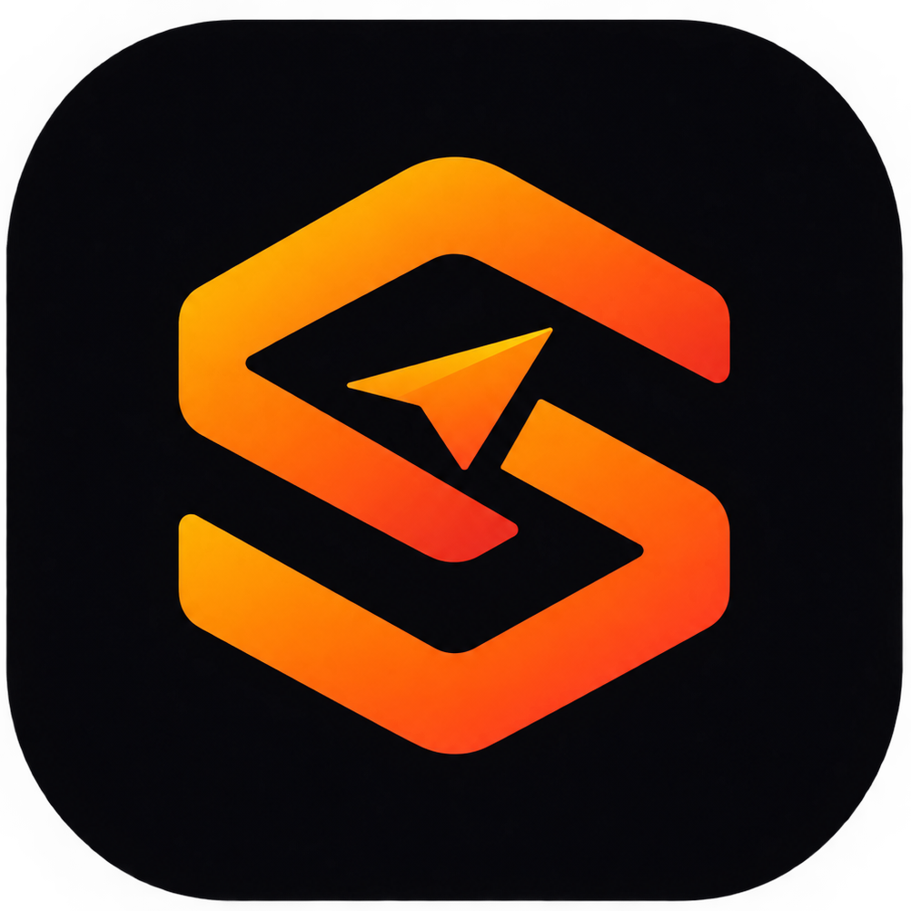
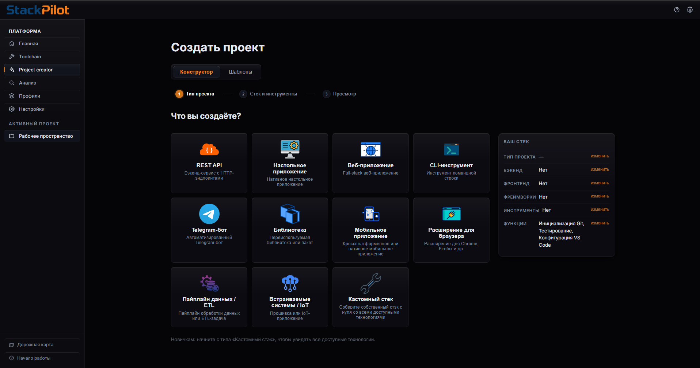

# StackPilot

<p align="center">
  
  <br>
  
</p>

> От идеи до готового каркаса проекта за 5–10 минут. Вместо нескольких часов настройки окружения.

[](https://www.gnu.org/licenses/agpl-3.0.html)
[](https://github.com/cheburek4535/StackPilot/releases)
[](https://tauri.app/)
[](https://kit.svelte.dev/)

<p align="center">
  <a href="https://cheburek4535.github.io/StackPilot">
    
  </a>
</p>

**StackPilot** — кроссплатформенное десктопное приложение для начинающих и продвинутых разработчиков, которое ускоряет и упрощает создание проектов, настройку окружения и работу с ними.

Вместо того чтобы тратить часы на установку инструментов, настройку Docker, создание конфигураций и ручной запуск команд — **StackPilot делает всё это автоматически**. Благодаря Tauri приложение очень лёгкое и компактное.

> **Статус:** активная open-source разработка, постепенный выпуск. Полностью бесплатно.

> [!WARNING]
> **StackPilot выходит постепенно.** На текущем этапе полностью поддерживается **Windows**; сборки для **Linux** и **macOS** публикуются в [Releases](https://github.com/cheburek4535/StackPilot/releases), но версия для Windows самая стабильная.
>
> Пока сборки не подписаны доверенным сертификатом, **Windows SmartScreen** может предупредить о «неизвестном издателе» — это ожидаемо, просто нажмите **«Подробнее» → «Выполнить в любом случае»**. Подробнее — в разделе [Установка и запуск](#установка-и-запуск).
>
> Добавление StackPilot в **winget** сейчас в процессе — автор активно занимается этим. Пока удобнее установить приложение со страницы Releases.

## Что нового в 1.2.3

- **Toolchain всегда скачивает новейшие версии ПО** — StackPilot сам определяет и ставит актуальные релизы инструментов.
- **Поддержка WSL** — DevLauncher проверяет готовность WSL2 перед запуском Docker и может установить её, если она отсутствует.
- **Исправлено много багов скачивания инструментов.**
- **Улучшен UX/UI**, в том числе конструктор стеков в Project Creator.
- **Мелкие правки** по всему приложению.

Полная история версий — на странице [Releases](https://github.com/cheburek4535/StackPilot/releases).

<p align="center">
  
</p>

<p align="center">
  <em>StackPilot: создание проектов, проверка окружения и запуск всего стека одной кнопкой.</em>
</p>

---

## Содержание

- [Что нового в 1.2.3](#что-нового-в-123)
- [Установка и запуск](#установка-и-запуск)
- [Как это работает](#как-это-работает)
- [Основные возможности](#основные-возможности)
- [Пример использования](#пример-использования)
- [Для кого StackPilot](#для-кого-stackpilot)
- [Быстрый старт](#быстрый-старт)
- [Что дальше](#что-дальше)
- [История проекта](#история-проекта)
- [Возможности для разработчиков](#возможности-для-разработчиков)
- [Поддерживаемые технологии](#поддерживаемые-технологии)
- [Сборка из исходников](#сборка-из-исходников)
- [Данные и приватность](#данные-и-приватность)
- [Безопасность](#безопасность)
- [Решение проблем](#решение-проблем)
- [FAQ](#faq)
- [Дополнительная документация](#дополнительная-документация)
- [Участие в разработке](#участие-в-разработке)
- [Лицензия](#лицензия)
- [Полезные ссылки](#полезные-ссылки)

---

## Установка и запуск

### 1. Скачайте дистрибутив

Перейдите на страницу [Releases](https://github.com/cheburek4535/StackPilot/releases) и скачайте последнюю версию. Доступны три формата:

| Формат | Что это | Когда выбирать |
| --- | --- | --- |
| **`.exe`** | Инсталлятор (NSIS) | Стандартная установка для пользователя |
| **`.msi`** | Инсталлятор MSI | Корпоративное развёртывание, тихая установка, политики |
| **`.zip`** | Портативная сборка | Portable-режим: распаковал и запустил без установки |

> Установка через **winget** пока в процессе. Скачивайте сборки только из раздела **Releases** этого репозитория и проверяйте имя файла и версию.

### 2. Установите приложение

- **`.exe` или `.msi`** — запустите установщик и следуйте шагам мастера.
- **`.zip`** — распакуйте архив в удобную папку и запустите `StackPilot.exe`.

### 3. Если Windows предупреждает о приложении

Пока сборки не подписаны сертификатом, SmartScreen может показать окно **«Windows защитил ваш компьютер»**. Это ожидаемо:

1. Нажмите **«Подробнее»** (More info);
2. Нажмите **«Выполнить в любом случае»** (Run anyway);
3. Продолжите установку и запуск.

Автор проекта активно работает над подписью кода и получением одобрений Microsoft — когда сертификат будет получен, предупреждение исчезнет.

### 4. Первый запуск

1. Откройте приложение — StackPilot покажет короткий onboarding.
2. Создайте проект в **Project Creator** или проанализируйте существующую папку в **DevLauncher → Анализ**.
3. Проверьте окружение в **Toolchain** (Scan) и установите недостающие инструменты.
4. Нажмите **Run** — весь стек запустится автоматически.

### Поддержка платформ

| Платформа | Статус |
| --- | --- |
| **Windows** (x64) | Полная поддержка |
| **Linux** (x64/arm64) | Сборки публикуются, дорабатывается |
| **macOS** (x64/arm64) | Сборки публикуются, дорабатывается |

Выход сборок для новых платформ анонсируется в разделе Releases.

Для Arch Linux и производных (Manjaro, EndeavourOS и т. п.) есть нативная установка через pacman — см. [Arch Linux](#arch-linux) в разделе «Сборка из исходников».

---

## Как это работает

StackPilot объединяет в одном месте работу с проектами, программным окружением, генерацией каркасов, запуском и рабочим пространством.

**Вместо:**

- Поиска и установки нужных инструментов вручную
- Создания структуры проекта с нуля
- Настройки Docker, баз данных и конфигураций
- Ручного запуска множества команд в разных терминалах

**Вы получаете:**

- Автоматическую проверку и установку всего необходимого ПО
- Готовый каркас проекта с правильной структурой и настройками
- Запуск всего стека одной кнопкой
- Удобное рабочее пространство для управления проектом

---

## Основные возможности

### 1. Контроль программного обеспечения и окружения

StackPilot анализирует требования каждого проекта и проверяет, всё ли необходимое установлено в системе:

- Проверяет наличие необходимых инструментов (Python, Node.js, Docker, Git и др.)
- Устанавливает недостающее ПО автоматически, всегда в актуальной версии
- Обновляет и удаляет инструменты
- Автоматически скачивает всё необходимое в один клик
- Управляет тем, какие инструменты использовать локально, а какие — в Docker
- Проверяет готовность **WSL2** перед запуском Docker на Windows и при необходимости помогает её установить
- Предоставляет маркет инструментов и программного обеспечения

Загрузка и установка проходят автоматически — не нужно вручную искать установщики и разбираться с каждым инструментом отдельно.

### 2. Генерация каркасов проектов

Ключевая возможность StackPilot — создание готовой основы проекта через визуальный конструктор:

- Выберите технологии вручную или используйте готовые пресеты
- Конструктор использует гибкие ограничения — несовместимые комбинации не предлагаются
- Предпросмотр будущих шагов генерации, структуры проекта и источников

**Например, можно выбрать:**
`Django + React + aiogram + PostgreSQL + Docker + Ruff + Pytest + Airflow + Kafka`

**StackPilot автоматически создаёт:**

- Базовую структуру папок и необходимые файлы
- Dockerfile, docker-compose.yaml, .dockerignore
- Зависимости и .env с конфигурацией
- Git-репозиторий с первым коммитом
- Конфигурацию выбранных инструментов
- Подробный README с объяснением созданного стека

Результат — не пустой шаблон, а полноценная подготовленная основа, где уже настроена инфраструктура. Можно сразу переходить к написанию бизнес-логики.

### 3. Быстрый запуск проектов

После генерации проект автоматически добавляется в профиль быстрого запуска. StackPilot может анализировать любую существующую папку с проектом, даже если она создана не в StackPilot.

На основе анализа создаётся набор асинхронных действий, выполняемых одной кнопкой:

- Открыть VS Code с нужной папкой
- Запустить backend и frontend в отдельных терминалах
- Открыть DBeaver для работы с базой данных
- Запустить Docker и создать необходимые контейнеры
- Поднять инструменты внутри Docker
- Открыть проект в браузере на localhost

Вместо ручного выполнения множества команд весь процесс собирается в единый сценарий. Также можно добавлять свои действия в конструкторе и изменять созданные.

### 4. Рабочее пространство

После запуска проект открывается в рабочем пространстве StackPilot:

- Управление запущенными процессами
- Просмотр логов и ошибок
- Отслеживание успешности выполнения отдельных действий
- Суммарное время работы над проектом
- Просмотр файлов
- Контроль состояния окружения и проекта

Единая точка управления проектом после его создания и запуска.

---

## Пример использования

Представим **Ваню** — студента второго курса, который хочет создать свой первый серьёзный проект. Он знает, что хочет сделать, но не знает, как правильно собрать всё необходимое: какой стек выбрать, какие зависимости установить, как настроить Docker, базу данных, Git и остальные инструменты.

Вместо нескольких часов ручной настройки он использует StackPilot.

1. **Онбординг.** Ваня проходит несколько коротких слайдов и знакомится с основными возможностями приложения.
2. **Конструктор.** Он выбирает Django (Python) для backend, React (TypeScript) для frontend, aiogram для Telegram-бота, PostgreSQL, Docker, Ruff, Pytest, Airflow и Kafka. StackPilot показывает будущие шаги генерации, ожидаемую структуру проекта и источники компонентов.
3. **Проверка окружения.** Приложение проверяет компьютер и определяет, установлены ли Python, Git, Docker и npm. Недостающее предлагается скачать и установить в один клик.
4. **Генерация.** За несколько минут появляются структура проекта, конфигурационные файлы, зависимости, Git-репозиторий и Docker-экосистема. Docker Compose подготовлен для запуска выбранных инструментов, а README объясняет структуру проекта.
5. **Запуск.** Проект добавляется в профиль быстрого запуска. Ваня нажимает одну кнопку — StackPilot открывает VS Code, запускает backend и frontend, открывает DBeaver, поднимает Docker-контейнеры и открывает приложение в браузере.
6. **Рабочее пространство.** В Workspace он видит запущенные процессы и отчёт об успешности действий, а затем переходит в VS Code и сразу начинает писать бизнес-логику.

**Результат:** путь от пустого компьютера и идеи до готового каркаса проекта и запущенной среды разработки занимает **около 5–10 минут** вместо потенциальных нескольких часов самостоятельной настройки. Особенно много времени экономится на Docker-экосистеме и инфраструктурной части проекта.

---

## Для кого StackPilot

- **Начинающим разработчикам**, которые создают свой первый серьёзный проект
- **Опытным разработчикам** с несколькими backend/frontend проектами
- **Командам**, которым нужен общий сценарий запуска без ручного открытия терминалов
- **Maintainer'ам**, которые проверяют чужие репозитории
- **Авторам open-source проектов**, которые хотят дать контрибьюторам понятный onboarding
- **Пользователям Windows, macOS или Linux**, которым нужен единый UI

StackPilot поддерживает неограниченное количество проектов и полностью бесплатен.

---

## Быстрый старт

### 1. Создайте проект или откройте существующий

- **С нуля:** откройте **Project Creator**, выберите тип, языки и фреймворки (или готовый пресет), проверьте preview и нажмите **Создать**.
- **Уже есть проект:** откройте **DevLauncher → Анализ**, выберите папку — StackPilot определит технологии и создаст черновик профиля запуска.

### 2. Проверьте окружение

В **Toolchain** запустите Scan. Это read-only операция: она ничего не устанавливает. StackPilot покажет, что уже есть, что отсутствует и что можно обновить, и предложит установить недостающее.

Если инструмент установлен, но не найден, перезапустите приложение или исправьте `PATH`.

### 3. Запустите проект

На странице профиля проверьте шаги, зависимости и рабочие каталоги и нажмите **Run**. Все команды и процессы запустятся автоматически. Для long-running сервисов используйте **Stop** на уровне процесса или всего запуска.

### 4. Работайте в Workspace

Откройте **Workspace**, чтобы следить за процессами, логами и проблемами. Статус `partial_success` означает, что некритичный шаг завершился ошибкой, но остальные сервисы продолжили работу.

---

## Что дальше

В ближайших обновлениях планируется:

- Контекстный AI-ассистент для помощи с подбором стека и анализом логов
- Разделение версий окружения для разных проектов
- Система плагинов
- Расширение списка поддерживаемых технологий
- Подпись сборок и одобрение **Microsoft SmartScreen**
- Добавление StackPilot в **winget**

---

## История проекта

Идея StackPilot появилась из собственного опыта разработки.

Когда начинаешь заниматься программированием и переходишь от небольших учебных проектов к чему-то более серьёзному, создание самого проекта часто оказывается далеко не самой сложной частью. Гораздо больше времени может уйти на настройку окружения: установку нужных программ, разбор Docker, настройку базы данных, зависимостей, Git, конфигурационных файлов и множества других вещей.

Со временем стало очевидно, что многие из этих действий можно автоматизировать и собрать в один понятный инструмент.

Так и появилась идея StackPilot — сделать приложение, которое снимает с разработчика большую часть рутинной инфраструктурной работы и позволяет быстрее перейти от идеи к непосредственно разработке.

StackPilot создавался не как абстрактный «универсальный генератор», а как решение реальной проблемы, с которой сталкиваются разработчики.

**Технологии:**
StackPilot — кроссплатформенное десктопное приложение на базе [Tauri 2](https://tauri.app/):

- **Rust** — системная часть и взаимодействие с операционной системой
- **Svelte + TypeScript** — пользовательский интерфейс

Такой подход позволяет совместить возможности десктопного приложения с современным веб-интерфейсом и сохранить кроссплатформенность.

---

## Возможности для разработчиков

### Модули приложения

- **DevLauncher** — анализ проекта, профили запуска, управление процессами.
- **Project Creator** — конструктор стеков и генерация каркаса проекта.
- **Toolchain** — scan, установка, обновление и починка инструментов, WSL/Docker.
- **Workspace** — процессы, логи, проблемы и файлы проекта.

Подробное описание модулей: [`docs/architecture.md`](docs/architecture.md).

### Рабочий цикл

```text
Открыть или создать проект
          │
          ▼
  Анализ / Project Creator
          │  стек + проектный контекст
          ▼
  Toolchain: scan → plan → install/repair
          │
          ▼
 DevLauncher: профиль (граф шагов)
          │
          ▼
  Run: процессы + readiness + логи
          │
          ▼
 Workspace: обзор, runtime, проблемы, файлы
```

Каждый запуск получает собственный `run_id`. Один профиль можно запускать повторно, а состояние и логи разных запусков не смешиваются. Профиль — это намерение («как поднять проект»), run — конкретная попытка («что произошло сейчас»).

### Профили запуска

Профиль хранится как JSON и описывает граф шагов: команды, сервисы, ожидание портов и URL, открытие IDE и браузера. Формат, типы шагов, политики завершения и окружения проекта описаны в [`docs/devlauncher-contract.md`](docs/devlauncher-contract.md).

---

## Поддерживаемые технологии

StackPilot поддерживает широкий спектр современных технологий:

**Языки:** Python, Rust, Go, TypeScript, JavaScript, Java, C#, C++, Dart, Kotlin, PHP, Swift, Zig, Elixir, Gleam, HTML

**Backend фреймворки:** FastAPI, Django, Flask, Axum, Gin, NestJS, Express, Spring Boot, Laravel, Symfony, Phoenix, Ktor

**Frontend фреймворки:** React, Vue, Svelte, Next.js, Nuxt, SvelteKit, SolidStart

**Мобильные и десктопные:** Flutter, React Native, Expo, Tauri, Electron, Qt, Jetpack Compose, SwiftUI

**Базы данных:** PostgreSQL, MongoDB, MySQL, SQLite, Redis/Memurai, ClickHouse

**Инструменты:** Docker, Git, VS Code, Kafka, Airflow, dbt, Grafana, Firebase, Terraform

**Testing и quality:** Pytest, Ruff

Полный каталог находится в [`src-tauri/src/modules/project_creator/knowledge/wizard_tree.json`](src-tauri/src/modules/project_creator/knowledge/wizard_tree.json) и [`src-tauri/src/modules/toolchain/tools.json`](src-tauri/src/modules/toolchain/tools.json).

---

## Сборка из исходников

### Требования

- Git;
- Node.js 18+ (рекомендуется 22 LTS) и npm;
- Rust stable и Cargo;
- системные зависимости Tauri 2 для вашей ОС;
- Windows: WebView2 и Visual Studio Build Tools/Windows SDK;
- Linux: GTK/WebKitGTK и пакеты, указанные в [Tauri prerequisites](https://v2.tauri.app/start/prerequisites/);
- macOS: Xcode Command Line Tools;
- опционально Bun (есть `bun.lock`, но npm поддерживается официальными scripts).

### Клонирование и зависимости

```bash
git clone https://github.com/cheburek4535/StackPilot.git
cd StackPilot
npm ci
```

### Запуск desktop-приложения

```bash
npm run tauri dev
```

Tauri сам запустит `npm run dev`, frontend будет доступен через `http://127.0.0.1:1420`, а окно подключится к нему.

### Production bundle

```bash
npm run tauri build
```

Результаты появятся в `src-tauri/target/release/bundle/` (`.msi`/`.exe`, `.dmg`, `.deb`, `.AppImage` и т. п. в зависимости от ОС). Перед публикацией проверьте подпись, installer и чистую установку на целевой ОС.

> **Важно:** production-бинарник нужно собирать именно через `npm run tauri build` (CLI), а не голым `cargo build --manifest-path src-tauri/Cargo.toml`. CLI добавляет cargo-флаг `--features tauri/custom-protocol`, который переключает вебвью со встроенных ассетов на dev-сервер (`devUrl`, `http://127.0.0.1:1420`). Без него релизный бинарник при запуске покажет окно с ошибкой `Could not connect to 127.0.0.1: Connection refused` вместо интерфейса. Если такой бинарник уже успели собрать напрямую через cargo, удалите `src-tauri/target` перед пересборкой через CLI — иначе в кэше могут остаться вперемешку артефакты обоих вариантов сборки, и поведение станет непредсказуемым от запуска к запуску.

### Arch Linux

`.deb`/`.rpm`/`.AppImage` из Releases на Arch напрямую не ставятся. Вместо этого в репозитории есть `PKGBUILD` для нативной установки через pacman:

```bash
git clone https://github.com/cheburek4535/StackPilot.git
cd StackPilot
./packaging/archlinux/install.sh
```

Скрипт упаковывает текущий checkout и собирает/устанавливает пакет через `makepkg -si` (спросит sudo для зависимостей и установки) — после этого `stackpilot` доступен как обычная pacman-пакетная программа, а `sudo pacman -R stackpilot` удаляет её без следов. Зависимости уровня сборки — `nodejs`, `npm`, `rust`, `cargo`; во время выполнения нужны `webkit2gtk-4.1` и `gtk3`, `makepkg` поставит их автоматически при необходимости.

На связке NVIDIA (проприетарный драйвер) + AMD iGPU вебвью WebKitGTK может падать при старте с `Failed to create GBM buffer` или Wayland `Error 71` — DMA-BUF рендерер несовместим с драйвером NVIDIA. С версии, включающей этот фикс, StackPilot сам отключает DMA-BUF рендерер на Linux (`WEBKIT_DISABLE_DMABUF_RENDERER=1`), если переменная не задана явно, так что дополнительных действий обычно не требуется.

### Только frontend (разработка UI)

```bash
npm run dev
npm run build
npm run preview
```

В браузерном режиме включается `tauriMock`: команды эмулируются в памяти/localStorage. Это удобно для UI, но не проверяет реальные процессы и взаимодействие с ОС.

---

## Данные и приватность

StackPilot — полностью локальное приложение:

- Все настройки хранятся на вашем компьютере
- Никакая информация не отправляется в интернет
- Установка ПО происходит через официальные источники (winget, Homebrew, apt и т.д.)
- Точный путь к данным приложения: **Настройки → Система → Папка данных приложения**

Фоновая телеметрия не используется. StackPilot выполняет только те команды, которые вы сами создали или подтвердили.

---

## Безопасность

Профили запуска — это исполняемые сценарии:

1. Просматривайте команды перед первым запуском
2. Не запускайте непроверенные JSON-профили из чужих источников
3. Не добавляйте API-ключи и токены в профили и `.env.example`
4. Используйте минимально необходимые права ОС

Генератор проверяет пути и конфликты, но не является sandbox'ом. Docker-альтернатива — это рекомендация, а не полная изоляция.

---

## Решение проблем

### `command not found` или PATH broken

1. Запустите **Toolchain Scan**
2. Проверьте найденные пути в карточке инструмента
3. Перезапустите StackPilot после установки инструментов

### Docker не готов

Убедитесь, что `docker version` работает и daemon запущен. На Windows Docker использует backend WSL2 — StackPilot проверит готовность WSL и предложит установить её, если она отсутствует.

### Сервис сразу завершается

Проверьте рабочую директорию и переменные окружения. Откройте stderr в **DevLauncher → Processes → Logs**.

### Порт занят

Измените порт в профиле или остановите старый процесс в **DevLauncher → Processes**.

### Не открывается IDE или браузер

Укажите полный путь в **Настройки → Система** или добавьте приложение в **Предпочтительные приложения**.

---

## FAQ

**StackPilot отправляет мой код в интернет?**
Нет, всё работает локально. Установщики скачивают ПО из официальных источников.

**Можно использовать только для запуска проектов?**
Да. Откройте существующую папку, проанализируйте её или создайте профиль вручную.

**Обязателен ли Docker?**
Нет. Docker — опция; многие инструменты устанавливаются локально.

**Где хранятся профили?**
В `<app_data>/profiles/*.json`; точный путь виден в Настройках.

**Что означает `partial_success`?**
Некритичный шаг не удался, но остальные сервисы продолжили работу. Проверьте логи проблемного шага.

---

## Дополнительная документация

Для разработчиков и интеграторов:

- [Архитектура и модули](docs/architecture.md) — внутреннее устройство DevLauncher, Project Creator, Toolchain и Workspace
- [Профили запуска V2](docs/devlauncher-contract.md) — формат JSON, типы шагов, политики завершения, окружения
- [Система совместимости инструментов](src-tauri/src/modules/project_creator/docs/COMPATIBILITY_RULES.md)
- [Метаданные инструментов](src-tauri/src/modules/project_creator/docs/TOOL_METADATA.md)

---

## Участие в разработке

Pull requests и issues приветствуются! Проект активно развивается, и вклад сообщества важен.

### Как начать

```bash
git checkout -b feature/my-feature
npm ci
npm run check
npm test
cd src-tauri
cargo fmt --check
cargo check
cargo test
```

### Что можно улучшить

- Добавить поддержку новых языков и фреймворков
- Улучшить определение проектов в анализаторе
- Расширить каталог инструментов для разных ОС
- Улучшить UI/UX
- Написать документацию
- Исправить баги

### Правила

- Перед большой задачей откройте issue с описанием
- В PR описывайте пользовательский эффект и затронутые ОС
- Добавляйте тесты для новой функциональности
- Не прикладывайте логи с токенами и персональными данными

Для изменений каталога инструментов указывайте detection, sources, platform availability и checksum. Для изменений DevLauncher сохраняйте совместимость профилей и обновляйте [`docs/devlauncher-contract.md`](docs/devlauncher-contract.md).

---

## Лицензия

StackPilot распространяется под [GNU Affero General Public License v3.0 only](https://www.gnu.org/licenses/agpl-3.0.html) (`AGPL-3.0-only`, как указано в `package.json`). Производные работы и изменения должны предоставляться на условиях AGPL-3.0, включая требования лицензии для сетевого взаимодействия с модифицированной версией. Перед коммерческим распространением прочитайте полный текст лицензии.

Автор и текущий maintainer: **cheburek4535**. Благодарности, предложения и контрибуции — через GitHub issues и pull requests.

---

## Полезные ссылки

- [Tauri 2 documentation](https://v2.tauri.app/)
- [SvelteKit documentation](https://kit.svelte.dev/docs)
- [Rust documentation](https://doc.rust-lang.org/)
- [Vite documentation](https://vite.dev/guide/)
