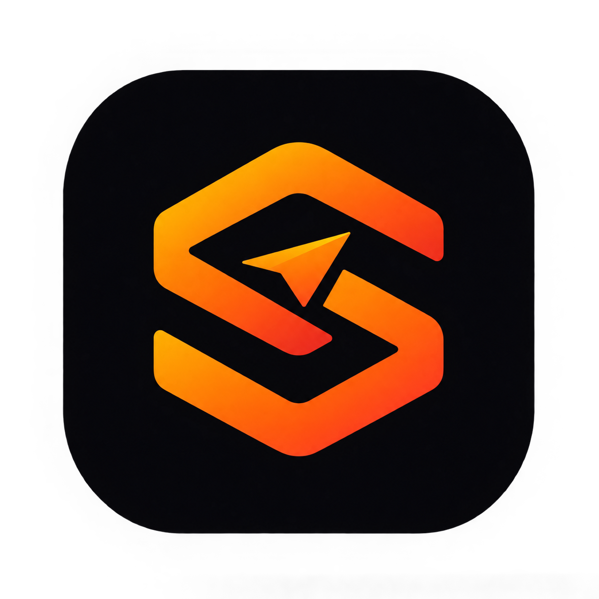
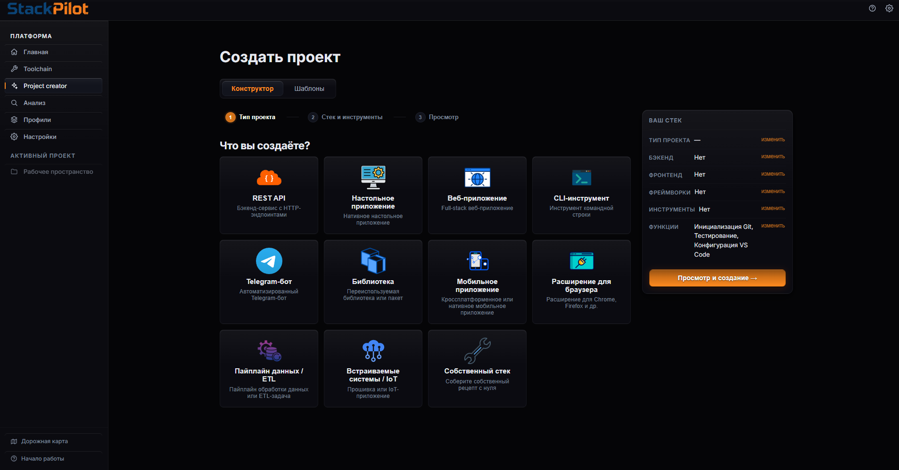

# StackPilot

<p align="center">
  
  <br>
  
</p>

> От идеи до готового каркаса проекта за 5–10 минут. Вместо нескольких часов настройки окружения.

[](https://www.gnu.org/licenses/agpl-3.0.html)
[](https://tauri.app/)
[](https://kit.svelte.dev/)
[](https://github.com/cheburek4535/StackPilot/releases)

**StackPilot** — кроссплатформенное десктопное приложение для начинающих и продвинутых разработчиков, которое ускоряет и упрощает создание проектов, настройку окружения и работу с ними.

Вместо того чтобы тратить часы на установку инструментов, настройку Docker, создание конфигураций и ручной запуск команд — **StackPilot делает всё это автоматически**.

При этом StackPilot потребляет всего **около 5 МБ оперативной памяти** и занимает **примерно 25 МБ дискового пространства** — благодаря Tauri это очень мало. Приложение компактное, лёгкое и практичное.

> **Статус:** активная open-source разработка, постепенный выпуск. Полностью бесплатно.

> [!WARNING]
> **StackPilot выходит постепенно.** На текущем этапе полностью поддерживается **Windows**; следующим будет добавлена поддержка **Linux**, затем — **macOS**.
>
> Пока сборки не подписаны доверенным сертификатом, **Windows SmartScreen** может предупредить о «неизвестном издателе». Это ожидаемо: просто нажмите **«Подробнее» → «Выполнить в любом случае»**. Автор проекта активно работает над подписью кода и одобрением сборок у Microsoft — когда сертификат будет получен, предупреждение исчезнет.
>
> Установщик доступен в трёх форматах — **`.zip`** (portable), **`.exe`** и **`.msi`** — на странице [GitHub Releases](https://github.com/cheburek4535/StackPilot/releases). Подробная инструкция — в разделе [Установка и запуск](#установка-и-запуск).

<p align="center">
  
</p>

<p align="center">
  <em>StackPilot: создание проектов, проверка окружения и запуск всего стека одной кнопкой.</em>
</p>

---

## Содержание

- [Установка и запуск](#установка-и-запуск)
- [Как это работает](#как-это-работает)
- [Основные возможности](#основные-возможности)
- [Пример использования](#пример-использования)
- [Для кого StackPilot](#для-кого-stackpilot)
- [Быстрый старт](#быстрый-старт)
- [Что дальше](#что-дальше)
- [История проекта](#история-проекта)
- [Технические детали](#технические-детали)
- [Установка](#установка)
- [Сборка из исходников](#сборка-из-исходников)
- [Участие в разработке](#участие-в-разработке)
- [Лицензия](#лицензия)

---

## Установка и запуск

### 1. Скачайте дистрибутив

Перейдите на страницу [Releases](https://github.com/cheburek4535/StackPilot/releases) и скачайте последнюю версию. Доступны три формата:

| Формат | Что это | Когда выбирать |
| --- | --- | --- |
| **`.exe`** | Инсталлятор (NSIS) | Стандартная установка для пользователя |
| **`.msi`** | Инсталлятор MSI | Корпоративное развёртывание, тихая установка, политики |
| **`.zip`** | Портативная сборка | Portable-режим: распаковал и запустил без установки |

> Скачивайте сборки только из раздела **Releases** этого репозитория и проверяйте имя файла и версию.

### 2. Установите приложение

- **`.exe` или `.msi`** — запустите установщик и следуйте шагам мастера.
- **`.zip`** — распакуйте архив в удобную папку и запустите `StackPilot.exe`.

### 3. Если Windows предупреждает о приложении

Пока сборки не подписаны сертификатом, SmartScreen может показать окно **«Windows защитил ваш компьютер»**. Это ожидаемо:

1. Нажмите **«Подробнее»** (More info);
2. Нажмите **«Выполнить в любом случае»** (Run anyway);
3. Продолжите установку и запуск.

Автор проекта активно работает над подписью кода и получением одобрений Microsoft — когда сертификат будет получен, предупреждение исчезнет.

### 4. Первый запуск

1. Откройте приложение — StackPilot покажет короткий onboarding.
2. Создайте проект в **Project Creator** или проанализируйте существующую папку в **DevLauncher → Анализ**.
3. Проверьте окружение в **Toolchain** (Scan) и установите недостающие инструменты.
4. Нажмите **Run** — весь стек запустится автоматически.

### Поддержка платформ

StackPilot выходит постепенно, платформы добавляются одна за другой:

| Платформа | Статус |
| --- | --- |
| **Windows** (x64) | Полная поддержка |
| **Linux** (x64/arm64) | Следующий этап (в разработке) |
| **macOS** (x64/arm64) | Запланировано |

Выход сборок для новых платформ анонсируется в разделе Releases.

---

## Как это работает

StackPilot объединяет в одном месте работу с проектами, программным окружением, генерацией каркасов, запуском и рабочим пространством.

**Вместо:**
- Поиска и установки нужных инструментов вручную
- Создания структуры проекта с нуля
- Настройки Docker, баз данных и конфигураций
- Ручного запуска множества команд в разных терминалах

**Вы получаете:**
- Автоматическую проверку и установку всего необходимого ПО
- Готовый каркас проекта с правильной структурой и настройками
- Запуск всего стека одной кнопкой
- Удобное рабочее пространство для управления проектом

---

## Основные возможности

### 1. Контроль программного обеспечения и окружения

StackPilot анализирует требования каждого проекта и проверяет, всё ли необходимое установлено в системе:

- Проверяет наличие необходимых инструментов (Python, Node.js, Docker, Git и др.)
- Устанавливает недостающее ПО автоматически
- Обновляет и удаляет инструменты
- Автоматически скачивает всё необходимое в один клик
- Управляет тем, какие инструменты использовать локально, а какие — в Docker
- Предоставляет маркет инструментов и программного обеспечения

Загрузка и установка проходят автоматически — не нужно вручную искать установщики и разбираться с каждым инструментом отдельно.

### 2. Генерация каркасов проектов

Ключевая возможность StackPilot — создание готовой основы проекта через визуальный конструктор:

- Выберите технологии вручную или используйте готовые пресеты
- Конструктор использует гибкие ограничения — несовместимые комбинации не предлагаются
- Предпросмотр будущих шагов генерации, структуры проекта и источников

**Например, можно выбрать:**  
`Django + React + aiogram + PostgreSQL + Docker + Ruff + Pytest + Airflow + Kafka`

**StackPilot автоматически создаёт:**
- Базовую структуру папок и необходимые файлы
- Dockerfile, docker-compose.yaml, .dockerignore
- Зависимости и .env с конфигурацией
- Git-репозиторий с первым коммитом
- Конфигурацию выбранных инструментов
- Подробный README с объяснением созданного стека

Результат — не пустой шаблон, а полноценная подготовленная основа, где уже настроена инфраструктура. Можно сразу переходить к написанию бизнес-логики.

### 3. Быстрый запуск проектов

После генерации проект автоматически добавляется в профиль быстрого запуска. StackPilot может анализировать любую существующую папку с проектом, даже если она создана не в StackPilot.

На основе анализа создаётся набор асинхронных действий, выполняемых одной кнопкой:

- Открыть VS Code с нужной папкой
- Запустить backend и frontend в отдельных терминалах
- Открыть DBeaver для работы с базой данных
- Запустить Docker и создать необходимые контейнеры
- Поднять инструменты внутри Docker
- Открыть проект в браузере на localhost

Вместо ручного выполнения множества команд весь процесс собирается в единый сценарий. Также можно добавлять свои действия в конструкторе и изменять созданные.

### 4. Рабочее пространство

После запуска проект открывается в рабочем пространстве StackPilot:

- Управление запущенными процессами
- Просмотр логов и ошибок
- Отслеживание успешности выполнения отдельных действий
- Суммарное время работы над проектом
- Просмотр файлов
- Контроль состояния окружения и проекта

Единая точка управления проектом после его создания и запуска.

---

## Пример использования

Представим **Ваню** — студента второго курса, который хочет создать свой первый серьёзный проект. Он знает, что хочет сделать, но не знает, как правильно собрать всё необходимое: какой стек выбрать, какие зависимости установить, как настроить Docker, базу данных, Git и остальные инструменты.

Вместо нескольких часов ручной настройки он использует StackPilot.

### 1. Быстрый онбординг
Ваня проходит несколько коротких слайдов и знакомится с основными возможностями приложения.

### 2. Конструктор проекта
Ваня решает создать B2B-платформу и выбирает в конструкторе:
- **Django** (Python) — backend
- **React** (TypeScript) — frontend
- **aiogram** (Python) — интеграция с Telegram-ботом
- **PostgreSQL** — база данных
- **Docker, Ruff, Pytest, Airflow, Kafka**

StackPilot анализирует выбранный стек, показывает будущие шаги генерации, ожидаемую структуру проекта и источники используемых компонентов.

### 3. Проверка окружения
Приложение автоматически проверяет компьютер Вани и определяет, установлены ли необходимые инструменты — Python, Git, Docker и npm. Если чего-то не хватает, StackPilot предлагает скачать и установить всё необходимое в один клик.

### 4. Генерация проекта
StackPilot последовательно создаёт каркас проекта. За несколько минут появляются структура проекта, необходимые конфигурационные файлы, зависимости, окружение, Git-репозиторий и Docker-экосистема.

Docker Compose уже подготовлен для запуска выбранных инструментов, а README подробно объясняет структуру проекта и назначение его компонентов.

**Вместо пустой папки получается готовый фундамент для разработки.**

### 5. Быстрый запуск
Созданный проект добавляется в профиль быстрого запуска. Ваня нажимает одну кнопку — и StackPilot выполняет заранее подготовленный сценарий:
- Открывает VS Code
- Запускает backend и frontend
- Открывает DBeaver
- Запускает Docker и создаёт контейнеры
- Запускает необходимые инструменты
- Открывает приложение в браузере

### 6. Рабочее пространство
После запуска Ваня переходит в рабочее пространство StackPilot, видит запущенные процессы и отчёт об успешности выполнения действий, а затем переходит в открывшийся VS Code и сразу начинает писать бизнес-логику в уже подготовленной среде.

### Результат
Путь от пустого компьютера и идеи до готового каркаса проекта и запущенной среды разработки занимает **около 5–10 минут** вместо потенциальных нескольких часов самостоятельного поиска информации, настройки окружения и ручного написания конфигураций.

Особенно много времени экономится на создании Docker-экосистемы и инфраструктурной части проекта — всё это не приходится собирать вручную.

---

## Для кого StackPilot

- **Начинающим разработчикам**, которые создают свой первый серьёзный проект
- **Опытным разработчикам** с несколькими backend/frontend проектами
- **Командам**, которым нужен общий сценарий запуска без ручного открытия терминалов
- **Maintainer'ам**, которые проверяют чужие репозитории
- **Авторам open-source проектов**, которые хотят дать контрибьюторам понятный onboarding
- **Пользователям Windows, macOS или Linux**, которым нужен единый UI

StackPilot поддерживает неограниченное количество проектов и полностью бесплатен.

---

## Быстрый старт

### 1. Откройте приложение
После первого запуска StackPilot показывает onboarding. Нажмите **Начало работы**, если нужно открыть его снова.

### 2. Выберите сценарий

**Создать новый проект:**
1. Откройте **Project Creator**
2. Выберите тип проекта, языки и фреймворки (или используйте готовый пресет)
3. Просмотрите предпросмотр структуры проекта
4. Нажмите **Создать**

**Работа с существующим проектом:**
1. Откройте **DevLauncher → Анализ**
2. Выберите папку проекта
3. StackPilot автоматически определит технологии и создаст профиль запуска

### 3. Проверьте окружение
В **Toolchain** запустите сканирование. Приложение проверит установленные инструменты и предложит установить недостающие.

### 4. Запустите проект
На странице профиля проверьте шаги и нажмите **Run**. Все необходимые команды и процессы запустятся автоматически.

### 5. Работайте в рабочем пространстве
Откройте **Workspace** для просмотра процессов, логов и управления проектом.

---

## Что дальше

В ближайших обновлениях планируется:

- Контекстный AI-ассистент для помощи с подбором стека и анализом логов
- Разделение версий окружения для разных проектов
- Система плагинов
- Расширение списка поддерживаемых технологий
- Поддержка **Linux**, затем **macOS**
- Подпись сборок и одобрение **Microsoft SmartScreen**

---

## История проекта

Идея StackPilot появилась из собственного опыта разработки.

Когда начинаешь заниматься программированием и переходишь от небольших учебных проектов к чему-то более серьёзному, создание самого проекта часто оказывается далеко не самой сложной частью. Гораздо больше времени может уйти на настройку окружения: установку нужных программ, разбор Docker, настройку базы данных, зависимостей, Git, конфигурационных файлов и множества других вещей.

Со временем стало очевидно, что многие из этих действий можно автоматизировать и собрать в один понятный инструмент.

Так и появилась идея StackPilot — сделать приложение, которое снимает с разработчика большую часть рутинной инфраструктурной работы и позволяет быстрее перейти от идеи к непосредственно разработке.

StackPilot создавался не как абстрактный «универсальный генератор», а как решение реальной проблемы, с которой сталкиваются разработчики.

**Технологии:**  
StackPilot — кроссплатформенное десктопное приложение на базе [Tauri 2](https://tauri.app/):
- **Rust** — системная часть и взаимодействие с операционной системой
- **Svelte + TypeScript** — пользовательский интерфейс

Такой подход позволяет совместить возможности десктопного приложения с современным веб-интерфейсом и сохранить кроссплатформенность.

---

## Технические детали

#### Модули приложения

Подробная информация о технической реализации для разработчиков и интеграторов.

#### DevLauncher

- анализирует проект и создаёт **черновик профиля запуска**;
- сохраняет профиль в JSON и запускает его повторно;
- поддерживает старый формат `actions` и новый графовый формат `steps`;
- запускает независимые шаги параллельно, а зависимые — после предшественников;
- выполняет одноразовые команды и долгоживущие сервисы;
- открывает нативное окно терминала, URL, IDE или папку;
- ждёт порт, URL или готовность Docker daemon;
- показывает прогресс каждого шага и итог `succeeded`, `partial_success`, `failed` или `cancelled`;
- останавливает процессы всего запуска вместе с деревом дочерних процессов;
- хранит логи ограниченного размера;
- показывает качество PID: `exact`, `terminal_wrapper`, `approximate`, `detached`.

### Project Creator

- пошаговый wizard с типом проекта, языками, backend/frontend-фреймворками и инструментами;
- готовые пресеты для API, full-stack, desktop/mobile, CLI, Telegram-ботов, ETL, browser extension и других сценариев;
- проверка совместимости и предупреждения о спорных комбинациях;
- рекомендации недостающих языков и инструментов;
- анализ существующего проекта;
- preview рецепта и дерева файлов до записи на диск;
- генерация файлов, директорий, шаблонов и конфигурации;
- опции Git init, VS Code, тестов, CI и Docker;
- передача созданного проекта в DevLauncher.

### Toolchain

- каталог инструментов с minimum/recommended версиями, зависимостями, конфликтами и источниками;
- read-only scan без установки ПО;
- обнаружение по `PATH`, version probe, известным путям и (только на Windows) реестру;
- честные состояния: установлен, отсутствует, нездоров, PATH broken, доступно обновление, manual only, Docker и другие;
- оценка здоровья окружения от 0 до 100;
- план установки, обновления, исправления PATH и health-check;
- Windows: winget и официальные установщики; macOS: Homebrew; Linux: apt, dnf, pacman, zypper и официальные скрипты;
- Docker как альтернатива локальной установке инфраструктурных сервисов;
- отмена, повтор и восстановление прерванных заданий;
- ручное добавление уже установленного инструмента (`adopt`).

### Workspace

- текущий проект и его стек;
- обзор сессии и времени работы;
- вкладки Runtime, Session, Logs, Problems, Info и Files;
- список процессов с PID, командой, cwd, статусом и длительностью;
- просмотр stdout/stderr в терминале xterm;
- файловый браузер с чтением и записью файлов;
- открытие проекта в VS Code;
- assistant-панель (UI-контур; подключение модели пока не выполняет запросы).

### Интерфейс

- русский и английский языки;
- светлая, тёмная и системная тема;
- размер шрифта, accent color, reduced motion и подсказки;
- восстановление последнего маршрута;
- список последних проектов;
- onboarding, который можно открыть повторно через кнопку помощи.

---

## Как устроен рабочий цикл

```text
Открыть или создать проект
          │
          ▼
  Анализ / Project Creator
          │  стек + проектный контекст
          ▼
  Toolchain: scan → plan → install/repair
          │
          ▼
 DevLauncher: профиль (граф шагов)
          │
          ▼
  Run: процессы + readiness + логи
          │
          ▼
 Workspace: обзор, runtime, проблемы, файлы
```

Каждый запуск получает собственный `run_id`. Один профиль можно запускать повторно, а состояние и логи разных запусков не смешиваются. Профиль — это намерение («как поднять проект»), run — конкретная попытка («что произошло сейчас»).

---

## Быстрый старт для пользователя

### 1. Откройте приложение

После первого запуска StackPilot показывает onboarding. Нажмите **Начало работы**, если нужно открыть его снова.

### 2. Выберите сценарий

- **Уже есть проект:** откройте **Анализ** или **DevLauncher → Анализ**.
- **Начинаете с нуля:** откройте **Project Creator**.
- **Проверяете компьютер:** откройте **Toolchain** и запустите Scan.
- **Профиль уже сохранён:** откройте **DevLauncher → Профили**.

### 3. Проверьте окружение

В Toolchain сначала выполните read-only Scan. Сканирование ничего не устанавливает. В карточке инструмента доступны доказательства: version probe, найденный путь, health-check и источник установки. Если инструмент установлен, но не найден, перезапустите приложение или исправьте PATH.

### 4. Запустите проект

На странице профиля проверьте шаги, зависимости и рабочие каталоги. Нажмите **Run**. Для long-running сервисов используйте **Stop** на уровне процесса или всего запуска.

### 5. Разбирайте ошибки

Откройте **Workspace → Problems** для агрегированных ошибок или **DevLauncher → Processes** для конкретного stdout/stderr. Статус `partial_success` означает, что некритичный шаг завершился ошибкой, но остальные сервисы продолжили работу.

---

## Модули приложения

### DevLauncher

DevLauncher — центр запуска. Разделы:

| Раздел | Назначение |
| --- | --- |
| **Обзор** | текущий проект, недавние проекты, быстрые действия и сохранённые профили |
| **Анализ** | построение черновика профиля по файлам проекта |
| **Профили** | просмотр, редактирование, удаление и запуск сохранённых сценариев |
| **Процессы** | ручной запуск команды, live-вывод, refresh и остановка |

#### Что анализатор проверяет

`FsProjectAnalyzer` ищет признаки проекта на глубину до 8 директорий: manifest/lock-файлы, entry points, Docker/compose, конфигурацию IDE, тесты и CI. Каждое предположение получает confidence (`high`, `medium`, `low`) и diagnostic. Анализ создаёт **draft**, а не безусловно правильный план — просмотрите его перед сохранением.

#### Типы шагов профиля

- `run_command` — команда с захваченным выводом;
- `run_script` — shell-скрипт (`sh`, `bash`, `zsh`, `fish`, `cmd`, `powershell`, `pwsh`);
- `open_application` — IDE, Docker Desktop или другое GUI-приложение;
- `open_url` — открыть адрес в браузере;
- `wait_for_port` — ждать TCP-порт;
- `wait_for_url` — ждать HTTP URL;
- `wait_for_docker` — ждать ответа Docker daemon;
- `delay` — фиксированная пауза;
- `open_terminal` — открыть нативный терминал;
- `open_folder` — открыть папку системным приложением.

### Анализ проекта

Анализ читает структуру и конфигурацию, но не запускает install-команды и не изменяет файлы. Результат включает найденные технологии, версии (если их можно вывести), существующие и отсутствующие конфигурации, признаки Git/CI/tests/README/license, подсказки типа проекта и diagnostics.

Если уверенность `low`, воспринимайте её как подсказку. Например, порт `3000` может быть выведен из типичного стека, но не гарантирует, что ваш сервер слушает именно его.

### Project Creator

Мастер создаёт `WizardContext`, валидирует выбранный стек и строит `ExecutionPlan`.

1. Выберите тип: REST API, web app, desktop/mobile, CLI, bot, library, data pipeline, embedded, browser extension или custom.
2. Укажите backend/frontend языки и фреймворки.
3. Добавьте базы, кэш, брокеры, observability, тесты и инструменты.
4. Выберите Docker или локальную инфраструктуру.
5. Включите Git, VS Code, CI и testing при необходимости.
6. Посмотрите recipe preview и file preview.
7. Подтвердите выполнение. Команды и запись файлов отображаются событиями по шагам.

Генерация не стирает существующие файлы молча: шаги имеют `overwrite`, а preview показывает, что будет создано, изменено или пропущено. Для существующей папки сделайте backup и проверьте preview.

### Система совместимости инструментов

Project Creator включает интеллектуальную валидацию совместимости инструментов:

- **Контроль зависимостей:** ловит недостающие зависимости (например, Alembic без SQLAlchemy);
- **Обнаружение пересечения ответственностей:** предупреждает, когда несколько инструментов выполняют одну роль (например, Django ORM + SQLAlchemy);
- **Предупреждения фреймворк↔инструмент:** объясняет, когда инструменты дублируют функции фреймворка;
- **Постепенная обратная связь:** ошибки блокируют генерацию, предупреждения информируют.

Подробная документация — в [`src-tauri/src/modules/project_creator/docs/`](src-tauri/src/modules/project_creator/docs/):
- `TOOL_METADATA.md` — справочник по схеме метаданных;
- `COMPATIBILITY_RULES.md` — логика валидации и правила решений;
- `IMPLEMENTATION_CHECKLIST.md` — статус реализации и известные ограничения.

### Toolchain

Toolchain разделён на три режима.

#### Manage everything

Показывает все определения каталога и состояние на вашей машине. Фильтры работают по статусу, health, категории, происхождению, возможностям и способу исполнения.

#### Build environment

Выберите тип проекта, языки и фреймворки. StackPilot рассчитывает обязательные, рекомендуемые и optional инструменты, учитывает зависимости и конфликты и предлагает план. Инфраструктурные сервисы можно установить локально или оставить Docker Compose проекта.

#### Tool Marketplace

Каталог доступных для текущей ОС инструментов работает даже без scan. Runtime-фильтры (состояние, health, происхождение) появятся только после scan.

#### Установка и права

Перед стартом показываются источник, примерный размер, необходимость администратора и checksum, если он объявлен в каталоге. Инструменты с `manual_install` не устанавливаются автоматически: для них показываются инструкции.

### Workspace

Workspace — представление текущего проекта, а не отдельная копия файлов. Закрытие Workspace не удаляет проект и не останавливает внешние процессы автоматически.

- **Overview:** сводка проекта и активных процессов.
- **Runtime:** статусы `starting`, `running`, `ready`, `exited`, `crashed`, `killed`, `timed_out`, `cancelled` и др.
- **Session:** время сессии, количество процессов и ошибок.
- **Logs:** захваченные логи процессов.
- **Problems:** ошибки из реального состояния процессов.
- **Info:** профиль, путь, стек и метаданные.
- **Files:** чтение/запись файлов в пределах выбранного проекта.

### Настройки

Вкладки **Личные**, **Система**, **Отображение**, **Поведение**, **ИИ** и **О приложении** позволяют настроить пути к VS Code/браузеру/терминалу, тему, язык, размер шрифта, accent color, автосохранение, восстановление маршрута, локальные личные метаданные и пользовательские GUI-приложения.

Раздел ИИ пока является фундаментом интерфейса: поля сохраняются, но запросы к OpenAI/Anthropic/Ollama/custom endpoint не отправляются, ключи не проверяются и assistant не активируется от одного переключателя.

---

## Поддерживаемые технологии

StackPilot поддерживает широкий спектр современных технологий:

**Языки:** Python, Rust, Go, TypeScript, JavaScript, Java, C#, C++, Dart, Kotlin, PHP, Swift, Zig, Elixir, Gleam, HTML

**Backend фреймворки:** FastAPI, Django, Flask, Axum, Gin, NestJS, Express, Spring Boot, Laravel, Symfony, Phoenix, Ktor

**Frontend фреймворки:** React, Vue, Svelte, Next.js, Nuxt, SvelteKit, SolidStart

**Мобильные и десктопные:** Flutter, React Native, Expo, Tauri, Electron, Qt, Jetpack Compose, SwiftUI

**Базы данных:** PostgreSQL, MongoDB, MySQL, SQLite, Redis/Memurai, ClickHouse

**Инструменты:** Docker, Git, VS Code, Kafka, Airflow, dbt, Grafana, Firebase, Terraform

**Testing и quality:** Pytest, Ruff

Полный каталог находится в [`src-tauri/src/modules/project_creator/knowledge/wizard_tree.json`](src-tauri/src/modules/project_creator/knowledge/wizard_tree.json) и [`src-tauri/src/modules/toolchain/tools.json`](src-tauri/src/modules/toolchain/tools.json).

---

## Установка

Профиль хранится как JSON в `<app_data>/profiles/<name>.json`.

Минимальный пример:

```json
{
  "schema_version": "2",
  "id": "api-stack",
  "name": "FastAPI + PostgreSQL",
  "description": "Локальный backend и база данных",
  "project_root": "C:/work/my-api",
  "preferred_ide": "Vscode",
  "steps": [
    {
      "id": "db",
      "label": "PostgreSQL",
      "enabled": true,
      "kind": { "type": "run_command", "command": "docker compose up db" },
      "visibility": "captured",
      "execution_mode": "long_running",
      "completion": { "type": "process_started" },
      "failure_policy": "stop_run"
    },
    {
      "id": "api",
      "label": "Uvicorn",
      "enabled": true,
      "depends_on": ["db"],
      "kind": { "type": "run_command", "command": "uvicorn app.main:app --reload --port 8000" },
      "visibility": "captured",
      "execution_mode": "long_running",
      "completion": { "type": "port_open", "host": "127.0.0.1", "port": 8000 },
      "timeout": 60,
      "failure_policy": "stop_run",
      "retry_policy": { "max_retries": 1, "delay_ms": 1000 }
    },
    {
      "id": "docs",
      "label": "Open API docs",
      "enabled": true,
      "depends_on": ["api"],
      "kind": { "type": "open_url", "url": "http://127.0.0.1:8000/docs" },
      "completion": { "type": "external_launch_accepted" },
      "failure_policy": "warn_and_continue"
    }
  ]
}
```

### Поля профиля

| Поле | Смысл |
| --- | --- |
| `schema_version` | сейчас `2`; старые файлы с `actions` мигрируются прозрачно |
| `id` | стабильный идентификатор профиля |
| `name`, `description` | имя и пояснение в UI |
| `project_root` | базовая рабочая директория для относительных путей |
| `environment_binding_id` | привязка к переопределениям окружения |
| `preferred_ide` | VS Code, PyCharm, GoLand, IDEA, WebStorm, Xcode, Visual Studio или custom |
| `steps` | узлы графа запуска |

У шага есть `id`, `label`, `enabled`, `kind`, `depends_on`, `working_directory`, `environment`, `visibility`, `execution_mode`, `completion`, `timeout`, `failure_policy`, `retry_policy` и `metadata`.

### Visibility и execution mode

- `captured` — stdout/stderr попадают в логи StackPilot;
- `visible_terminal` — команда выполняется в нативном окне терминала;
- `detached` — GUI/внешний процесс запускается без захвата вывода;
- `one_shot` — шаг завершается после успешного выхода процесса;
- `long_running` — сервис остаётся активным до остановки или падения.

### Политика завершения и ошибок

Completion policy может быть `exit_success`, `process_started`, `port_open`, `url_ready`, `delay_elapsed`, `external_launch_accepted` или `manual`. Ошибка шага обрабатывается явно:

- `stop_run` — остановить run и его управляемые процессы;
- `skip_dependents` — пропустить зависимые шаги;
- `warn_and_continue` — продолжить и получить `partial_success`.

Зависимости должны ссылаться на существующие ID и не образовывать цикл. Валидация проверяет пустые команды, некорректные порты/URL, несовместимый shell и циклы до запуска.

### Обратная совместимость

Старый формат с плоским массивом `actions` поддерживается legacy API. При обращении через V2 действия превращаются в последовательные шаги, а при сохранении новый формат остаётся V2. Не удаляйте `actions` вручную, если профиль используют старые интеграции.

---

## Окружения проекта и bindings

`EnvironmentBinding` позволяет не менять глобальную систему ради одного проекта. Binding может содержать путь конкретного `python`, `node`, `cargo` и другого executable, дополнительные PATH entries, переменные для установки/удаления, рекомендуемый IDE и привязку к абсолютному пути проекта.

Binding хранится в `<app_data>/project_environments/<binding_id>.json` и применяется как overlay при запуске. Относительные и отсутствующие executable дают warning. Это удобно для нескольких версий Node/Python, SDK в нестандартных каталогах и portable toolchain.

### Платформы

StackPilot ориентирован на **Windows, Linux и macOS** (x64/arm64). Приложение выходит постепенно: на текущем этапе полностью поддерживается Windows, а Linux и macOS подключаются следующими.

| Платформа | Установка ПО | Терминал |
| --- | --- | --- |
| Windows | winget | Windows Terminal или cmd |
| Linux | apt/dnf/pacman/zypper | автоопределение |
| macOS | Homebrew | Terminal.app или iTerm2 |

### Установка готового приложения

Репозиторий содержит исходники, а готовые сборки распространяются через [Releases](https://github.com/cheburek4535/StackPilot/releases) в форматах **`.zip`** (portable), **`.exe`** и **`.msi`** (установщики). Полная инструкция для пользователя — в разделе [Установка и запуск](#установка-и-запуск).

> Пока сборки не подписаны сертификатом, Windows SmartScreen может требовать **«Подробнее» → «Выполнить в любом случае»**. Автор активно работает над подписью кода и одобрением сборок у Microsoft.

Для запуска из исходников используйте инструкцию ниже.

---

## Сборка из исходников

### Требования

- Git;
- Node.js 18+ (рекомендуется 22 LTS) и npm;
- Rust stable и Cargo;
- системные зависимости Tauri 2 для вашей ОС;
- Windows: WebView2 и Visual Studio Build Tools/Windows SDK;
- Linux: GTK/WebKitGTK и пакеты, указанные в [Tauri prerequisites](https://v2.tauri.app/start/prerequisites/);
- macOS: Xcode Command Line Tools;
- опционально Bun (есть `bun.lock`, но npm поддерживается официальными scripts).

### Клонирование и зависимости

```bash
git clone https://github.com/cheburek4535/StackPilot.git
cd StackPilot
npm ci
```

Или Bun:

```bash
bun install --frozen-lockfile
```

### Запуск desktop-приложения

```bash
npm run tauri dev
```

Tauri сам запустит `npm run dev`, frontend будет доступен через `http://127.0.0.1:1420`, а окно подключится к нему.

### Production bundle

```bash
npm run tauri build
```

Результаты появятся в `src-tauri/target/release/bundle/` (`.msi`/`.exe`, `.dmg`, `.deb`, `.AppImage` и т. п. в зависимости от ОС). Перед публикацией проверьте подпись, installer и чистую установку на целевой ОС.

### Только frontend (разработка UI)

```bash
npm run dev
npm run build
npm run preview
```

В браузерном режиме включается `tauriMock`: команды эмулируются в памяти/localStorage. Это удобно для UI, но не проверяет реальные процессы и взаимодействие с ОС.

---

## Данные и приватность

StackPilot — полностью локальное приложение:

- Все настройки хранятся на вашем компьютере
- Никакая информация не отправляется в интернет
- Установка ПО происходит через официальные источники (winget, Homebrew, apt и т.д.)
- Точный путь к данным приложения: **Настройки → Система → Папка данных приложения**

Фоновая телеметрия не используется. StackPilot выполняет только те команды, которые вы сами создали или подтвердили.

---

## Безопасность

Профили запуска — это исполняемые сценарии:

⚠️ **Важно:**
1. Просматривайте команды перед первым запуском
2. Не запускайте непроверенные JSON-профили из чужих источников
3. Не добавляйте API-ключи и токены в профили и `.env.example`
4. Используйте минимально необходимые права ОС

Генератор проверяет пути и конфликты, но не является sandbox'ом. Docker-альтернатива — это рекомендация, а не полная изоляция.

---

## Решение проблем

### `command not found` или PATH broken
1. Запустите **Toolchain Scan**
2. Проверьте найденные пути в карточке инструмента
3. Перезапустите StackPilot после установки инструментов

### Docker не готов
Убедитесь, что `docker version` работает и daemon запущен. На Windows может потребоваться WSL2.

### Сервис сразу завершается
Проверьте рабочую директорию и переменные окружения. Откройте stderr в **DevLauncher → Processes → Logs**.

### Порт занят
Измените порт в профиле или остановите старый процесс в **DevLauncher → Processes**.

### Не открывается IDE или браузер
Укажите полный путь в **Настройки → Система** или добавьте приложение в **Предпочтительные приложения**.

---

## FAQ

**StackPilot отправляет мой код в интернет?**  
Нет, всё работает локально. Установщики скачивают ПО из официальных источников.

**Можно использовать только для запуска проектов?**  
Да. Откройте существующую папку, проанализируйте её или создайте профиль вручную.

**Обязателен ли Docker?**  
Нет. Docker — опция; многие инструменты устанавливаются локально.

**Где хранятся профили?**  
В `<app_data>/profiles/*.json`; точный путь виден в Настройках.

**Что означает `partial_success`?**  
Некритичный шаг не удался, но остальные сервисы продолжили работу. Проверьте логи проблемного шага.

---

## Дополнительная документация

Для разработчиков и интеграторов доступна подробная техническая документация:

- [Профили запуска V2](docs/devlauncher-contract.md) — формат JSON, типы шагов, политики завершения
- [Система совместимости инструментов](src-tauri/src/modules/project_creator/docs/COMPATIBILITY_RULES.md)
- [Метаданные инструментов](src-tauri/src/modules/project_creator/docs/TOOL_METADATA.md)
- [Окружения проекта и bindings](src-tauri/src/modules/project_environment/)
- [Структура репозитория и архитектура](docs/)

---

## Участие в разработке

Pull requests и issues приветствуются! Проект активно развивается, и вклад сообщества важен.

### Как начать

```bash
git checkout -b feature/my-feature
npm ci
npm run check
npm test
cd src-tauri
cargo fmt --check
cargo check
cargo test
```

### Что можно улучшить

- Добавить поддержку новых языков и фреймворков
- Улучшить определение проектов в анализаторе
- Расширить каталог инструментов для разных ОС
- Улучшить UI/UX
- Написать документацию
- Исправить баги

### Правила

- Перед большой задачей откройте issue с описанием
- В PR описывайте пользовательский эффект и затронутые ОС
- Добавляйте тесты для новой функциональности
- Не прикладывайте логи с токенами и персональными данными

Для изменений каталога инструментов указывайте detection, sources, platform availability и checksum. Для изменений DevLauncher сохраняйте совместимость профилей и обновляйте [`docs/devlauncher-contract.md`](docs/devlauncher-contract.md).

---

## Лицензия

StackPilot распространяется под [GNU Affero General Public License v3.0 only](https://www.gnu.org/licenses/agpl-3.0.html) (`AGPL-3.0-only`, как указано в `package.json`). Производные работы и изменения должны предоставляться на условиях AGPL-3.0, включая требования лицензии для сетевого взаимодействия с модифицированной версией. Перед коммерческим распространением прочитайте полный текст лицензии.

Автор и текущий maintainer: **cheburek4535**. Благодарности, предложения и контрибуции — через GitHub issues и pull requests.

---

## Полезные ссылки

- [Tauri 2 documentation](https://v2.tauri.app/)
- [SvelteKit documentation](https://kit.svelte.dev/docs)
- [Rust documentation](https://doc.rust-lang.org/)
- [Vite documentation](https://vite.dev/guide/)
