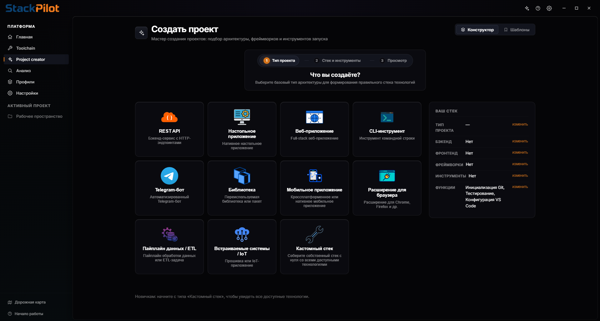

# StackPilot

<p align="center">
  
  <br>
  
</p>

> От идеи до готового каркаса проекта за 5–10 минут. Вместо нескольких часов настройки окружения.

[](https://www.gnu.org/licenses/agpl-3.0.html)
[](https://github.com/cheburek4535/StackPilot/releases)
[](#-stackpilot-cli-stkpil--полная-мощь-в-терминале)
[](https://tauri.app/)
[](https://kit.svelte.dev/)

<p align="center">
  <a href="https://cheburek4535.github.io/StackPilot">
    
  </a>
</p>

**StackPilot** — экосистема для начинающих и продвинутых разработчиков, ускоряющая создание проектов, настройку окружения и управление сервисами. Доступна как в виде интуитивного десктопного приложения (**GUI**), так и в виде молниеносной консольной утилиты (**CLI `stkpil`**) — для тех, кто ценит работу в терминале!

Вместо того чтобы тратить часы на установку инструментов, настройку Docker, создание конфигураций и ручной запуск команд — **StackPilot делает всё это автоматически**. Благодаря Tauri приложение очень лёгкое и компактное, а встроенный CLI даёт полный контроль над созданием и запуском проектов прямо из вашей любимой консоли.

> **Статус:** активная open-source разработка, постепенный выпуск. Полностью бесплатно.

> [!WARNING]
> **StackPilot выходит постепенно.** На текущем этапе полностью поддерживается **Windows**; сборки для **Linux** и **macOS** публикуются в [Releases](https://github.com/cheburek4535/StackPilot/releases), но версия для Windows самая стабильная.
>
> Пока сборки не подписаны доверенным сертификатом, **Windows SmartScreen** может предупредить о «неизвестном издателе» — это ожидаемо, просто нажмите **«Подробнее» → «Выполнить в любом случае»**. Подробнее — в разделе [Установка и запуск](#установка-и-запуск).
>
> Добавление StackPilot в **winget** сейчас в процессе — автор активно занимается этим. Пока удобнее установить приложение со страницы Releases.

## Что нового в 1.4.0

- ** Изоляция виртуальных окружений проектов (Virtual Environments)**:
  - Полное разделение зависимостей и рантаймов между проектами — устраняет конфликты глобальных пакетов и версий.
  - Управление через графический интерфейс: новый экран **Окружения**, связывание проектов с окружениями, выбор режима изоляции при создании проекта.
  - Терминальное управление через `stkpil env` (`list`, `run`, `shell`, `bind`, `export`) — запуск любых скриптов и команд в контексте изолированного окружения.
- ** Интерактивный CLI-мастер создания проектов (`stkpil create`)**:
  - Пошаговый интерактивный мастер в терминале с поддержкой пресетов и кастомных конфигураций.
  - Движок валидации ограничений стека (`constraints`) для предотвращения несовместимых сочетаний технологий.
  - Исправление генератора AdonisJS и скриптов добавления зависимостей.
- ** Оптимизация и интеграция для Linux**:
  - Тонкая настройка рендеринга WebKitGTK / Wayland / X11, аппаратного ускорения и прозрачности окон.
  - Обновлённые пакеты Arch Linux (`PKGBUILD`, `PKGBUILD-bin`) и скрипт быстрой установки `install.sh`.
- ** Оптимизация для macOS**:
  - Нативный запуск IDE и приложений через `open`, правильное разрешение путей к бинарникам и бандлам `.app`.
  - Улучшенная поддержка Homebrew и Apple Silicon.
- ** Полировка интерфейса Toolchain**:
  - Обновлённый режим «Manage Everything» и Hero-блок состояния системы.

Полная история версий — на странице [Releases](https://github.com/cheburek4535/StackPilot/releases).

<p align="center">
  
</p>

<p align="center">
  <em>StackPilot: создание проектов, проверка окружения и запуск всего стека одной кнопкой.</em>
</p>

---

## Содержание

- [Что нового в 1.4.0](#что-нового-в-140)
- [Установка и запуск](#установка-и-запуск)
- [🚀 StackPilot CLI (stkpil) — Полная мощь в терминале](#-stackpilot-cli-stkpil--полная-мощь-в-терминале)
  - [Что такое CLI и как открыть терминал](#что-такое-cli-и-как-открыть-терминал)
  - [Быстрая проверка работы](#быстрая-проверка-работы)
  - [1. Создание проектов (`stkpil create`)](#1-создание-проектов-stkpil-create)
  - [2. Диагностика системы (`stkpil doctor`)](#2-диагностика-системы-stkpil-doctor)
  - [3. Установка и обновление ПО (`install` / `update` / `status`)](#3-установка-и-обновление-по-install--update--status)
  - [4. Запуск и оркестрация стека (`stkpil launch` / `dev`)](#4-запуск-и-оркестрация-стека-stkpil-launch--dev)
  - [5. Анализ чужих или существующих проектов (`stkpil analyze`)](#5-анализ-чужих-или-существующих-проектов-stkpil-analyze)
  - [Шпаргалка команд CLI](#шпаргалка-команд-cli)
- [Как это работает](#как-это-работает)
- [Основные возможности](#основные-возможности)
- [Пример использования](#пример-использования)
- [Для кого StackPilot](#для-кого-stackpilot)
- [Быстрый старт](#быстрый-старт)
- [Что дальше](#что-дальше)
- [История проекта](#история-проекта)
- [Возможности для разработчиков](#возможности-для-разработчиков)
- [Поддерживаемые технологии](#поддерживаемые-технологии)
- [Сборка из исходников](#сборка-из-исходников)
- [Данные и приватность](#данные-и-приватность)
- [Безопасность](#безопасность)
- [Решение проблем](#решение-проблем)
- [FAQ](#faq)
- [Дополнительная документация](#дополнительная-документация)
- [Участие в разработке](#участие-в-разработке)
- [Лицензия](#лицензия)
- [Полезные ссылки](#полезные-ссылки)

---

## Установка и запуск

### 1. Скачайте дистрибутив

Перейдите на страницу [Releases](https://github.com/cheburek4535/StackPilot/releases) и скачайте последнюю версию. Доступны три формата:

| Формат | Что это | Когда выбирать |
| --- | --- | --- |
| **`.exe`** | Инсталлятор (NSIS) | Стандартная установка для пользователя |
| **`.msi`** | Инсталлятор MSI | Корпоративное развёртывание, тихая установка, политики |
| **`.zip`** | Портативная сборка | Portable-режим: распаковал и запустил без установки |

> Установка через **winget** пока в процессе. Скачивайте сборки только из раздела **Releases** этого репозитория и проверяйте имя файла и версию.

### 2. Установите приложение

- **`.exe` или `.msi`** — запустите установщик и следуйте шагам мастера.
- **`.zip`** — распакуйте архив в удобную папку и запустите `StackPilot.exe`.

### 3. Если Windows предупреждает о приложении

Пока сборки не подписаны сертификатом, SmartScreen может показать окно **«Windows защитил ваш компьютер»**. Это ожидаемо:

1. Нажмите **«Подробнее»** (More info);
2. Нажмите **«Выполнить в любом случае»** (Run anyway);
3. Продолжите установку и запуск.

Автор проекта активно работает над подписью кода и получением одобрений Microsoft — когда сертификат будет получен, предупреждение исчезнет.

### 4. Первый запуск

1. Откройте приложение — StackPilot покажет короткий onboarding.
2. Создайте проект в **Project Creator** или проанализируйте существующую папку в **DevLauncher → Анализ**.
3. Проверьте окружение в **Toolchain** (Scan) и установите недостающие инструменты.
4. Нажмите **Run** — весь стек запустится автоматически.

### Поддержка платформ

| Платформа | Архитектура | Статус | Форматы |
| --- | --- | --- | --- |
| **Windows** | x64 | **Стабильно (флагманская)** | `.msi`, setup `.exe`, `.zip` (portable) |
| **macOS** | Apple Silicon (M1–M4), Intel | **Значительно улучшено** (Homebrew, `.pkg`, `.dmg`, Docker socket) | `.dmg` (arm64, x64), `.app.tar.gz` |
| **Linux** | x64, arm64 | **Умеренно стабильно** | `.deb`, `.rpm`, `.AppImage`, AUR/PKGBUILD |

Выход сборок для всех платформ осуществляется автоматически через GitHub Actions при каждом релизе.

Для Arch Linux и производных (Manjaro, EndeavourOS и т. п.) есть нативная установка через pacman — см. [Arch Linux](#arch-linux) в разделе «Сборка из исходников».

#### 🍎 Установка на macOS

1. **Выберите сборку под свой процессор в [Releases](https://github.com/cheburek4535/StackPilot/releases):**
   - **`StackPilot-...-aarch64.dmg`** — для компьютеров Mac на базе Apple Silicon (**M1, M2, M3, M4**).
   - **`StackPilot-...-x64.dmg`** — для компьютеров Mac на процессорах **Intel**.
2. **Установка:**
   - Откройте скачанный файл `.dmg` и перетащите иконку **StackPilot** в папку **«Программы»** (`/Applications`).
3. **Если macOS пишет «Программа повреждена» (Gatekeeper):**
   - Так как сборки открытого проекта публикуются без коммерческой платной подписи Apple, встроенная защита macOS (Gatekeeper) помещает приложение на карантин.
   - Чтобы запустить приложение, откройте **Терминал** и выполните команду:
     ```bash
     xattr -cr /Applications/StackPilot.app
     ```
   - *Или:* Перейдите в **«Системные настройки» → «Конфиденциальность и безопасность»**, прокрутите вниз до раздела «Безопасность» и нажмите **«Всё равно открыть»** (*Open Anyway*).
4. **Консоль `stkpil` на macOS:**
   - StackPilot при первом запуске автоматически создаёт симлинк утилиты `stkpil` в `/usr/local/bin/stkpil` и `~/.local/bin/stkpil`.
   - Если ваш терминал пишет `command not found: stkpil`, добавьте путь в свой `~/.zshrc`:
     ```bash
     echo 'export PATH="$HOME/.local/bin:$PATH"' >> ~/.zshrc && source ~/.zshrc
     ```
5. **Запуск терминала из интерфейса:**
   - При первом открытии вкладки терминала из StackPilot система спросит: *«StackPilot запрашивает разрешение на управление "Терминал"»* — нажмите **«Разрешить»** (OK).

---

## 🚀 StackPilot CLI (`stkpil`) — Полная мощь в терминале

Наряду с удобным графическим интерфейсом, StackPilot включает в себя **`stkpil`** — полноценный консольный инструмент (CLI), который доступен прямо из командной строки.

> **Зачем нужен CLI, если есть красивое окно?**  
> Консольная утилита позволяет создавать проекты за 3 секунды одной короткой строкой, автоматизировать рутину в скриптах, управлять инструментами на серверах и запускать все сервисы проекта в одной аккуратной консоли с цветными логами без лишней траты ресурсов.

---

### Что такое CLI и как открыть терминал

Если вы никогда в жизни не пользовались командной строкой — **не переживайте, здесь нет ничего сложного!**

**CLI (Command Line Interface)** — это способ управления компьютером не кликами мыши, а вводом понятных текстовых команд (например, `stkpil create`). Это похоже на диалог с умным помощником.

#### Как открыть терминал на вашем компьютере:

- **Windows:**
  - *Способ 1 (самый быстрый):* Нажмите комбинацию клавиш `Win + R` на клавиатуре, введите `cmd` или `wt` (Windows Terminal) и нажмите `Enter`.
  - *Способ 2:* Нажмите правой кнопкой мыши по меню «Пуск» (логотип Windows в левом нижнем углу) и выберите **«Терминал»** или **«PowerShell»**.
  - *Способ 3 (прямо в нужной папке):* Откройте любую папку в Проводнике Windows, кликните мышью в адресную строку папки вверху, сотрите путь, напишите `cmd` и нажмите `Enter` — терминал откроется прямо в этой папке!
- **macOS:**
  - Нажмите `Cmd + Пробел` (Spotlight), напишите `Terminal` и нажмите `Enter`.
- **Linux:**
  - Нажмите `Ctrl + Alt + T` или найдите приложение «Терминал» в списке программ.

---

### Быстрая проверка работы

После установки StackPilot команда `stkpil` становится доступной глобально. Чтобы проверить готовность, просто напишите в открытом терминале:

```bash
stkpil --help
```

Вы увидите красивое приветствие со списком всех доступных команд.

> [!TIP]
> **Что делать, если Windows пишет: *«"stkpil" не является внутренней или внешней командой»*?**  
> 1. Если окно терминала было открыто **до** того, как вы установили StackPilot, просто закройте это окно терминала и откройте его заново (система должна обновить список путей `PATH`).  
> 2. Если вы скачали портативную версию (`.zip`), скопируйте файл `stkpil.exe` в любую папку, которая уже есть в вашем `PATH` (например, `C:\Windows\System32` или в папку с установленным Cargo `~/.cargo/bin`), либо добавьте папку распакованного архива в переменные среды пользователя.

---

### 1. Создание проектов (`stkpil create`)

Модуль генерации проектов позволяет поднять готовый рабочий каркас приложения со всей инфраструктурой (Docker, БД, линтеры, Git).

#### Вариант А: Интерактивный мастер (рекомендуется для новичков)

Просто введите команду без параметров:

```bash
stkpil create
```

В консоли запустится пошаговый визуальный визард:
1. Выберите **тип проекта** с помощью стрелочек `↑`/`↓` на клавиатуре (Веб-сервис, Telegram-бот, Fullstack-приложение, Мобильное приложение и др.) и нажмите `Enter`.
2. Выберите нужные технологии (бэкенд, фронтенд, базы данных, очереди, линтеры). Несовместимые комбинации система отфильтрует автоматически!
3. Укажите название проекта и путь для сохранения.
4. Нажмите **Create** — проект развернётся за считанные секунды.

```text
? Выберите тип проекта:
  Fullstack Web App (Frontend + Backend)
> Backend API Microservice
  Telegram / Discord Bot
  CLI Utility / Desktop App
```

#### Вариант Б: Режим одной строки (для опытных разработчиков)

Если вы точно знаете, что хотите получить, не обязательно проходить шаги мастера. Соберите проект одной командой:

```bash
# Создать проект: FastAPI + React + PostgreSQL + Redis + Docker и сразу открыть его в редакторе (-o)
stkpil create -b fastapi -f react -i postgresql redis docker -n "my-super-app" -o
```

**Полезные флаги команды `stkpil create`:**

| Флаг | Полное имя | Описание | Пример |
| --- | --- | --- | --- |
| `-b` | `--backend` | Технология бэкенда | `-b fastapi`, `-b django`, `-b nestjs`, `-b axum`, `-b rails`, `-b fiber` |
| `-f` | `--frontend` | Технология фронтенда | `-f react`, `-f vue`, `-f svelte`, `-f angular`, `-f next`, `-f vite` |
| `-i` | `--infra` | Инфраструктура, БД, линтеры (через пробел) | `-i postgresql redis docker ruff pytest` |
| `-n` | `--name` | Название проекта | `-n "awesome-project"` |
| `-p` | `--path` | Путь, где создать проект | `-p "C:\Projects"` или `-p .` (в текущей папке) |
| `-o` | `--open` | Сразу открыть в редакторе кода | `-o` (или `-o cursor`, `-o webstorm`) |
| `--dry-run` | `--dry-run` | Безопасный предпросмотр файлов без записи на диск | `stkpil create --dry-run -b go -f react` |

#### Каталог всех поддерживаемых технологий:

Хотите узнать все доступные ключевые слова для флагов? Введите:

```bash
stkpil list
```

---

### 2. Диагностика системы (`stkpil doctor`)

Вам больше не нужно гадать, установлен ли на компьютере Python, свежая ли версия Node.js или запущен ли Docker.

```bash
stkpil doctor
```

**Что делает `stkpil doctor`:**
1. Проводит полный аудит всех компиляторов, рантаймов, менеджеров пакетов, баз данных и devops-утилит.
2. Выводит аккуратную сводную таблицу с галочками и номерами установленных версий.
3. **Открывает интерактивное меню**: стрелочками и пробелом вы можете отметить недостающие или устаревшие программы, и StackPilot сам скачает и установит их в официальных версиях!

**Автоматические режимы:**

```bash
# Установить все недостающие программы без лишних вопросов:
stkpil doctor --install-missing -y

# Проверить только инструменты конкретной категории (languages, databases, devops, tools, package_managers):
stkpil doctor --category database
```

---

### 3. Установка и обновление ПО (`install` / `update` / `status`)

Вам срочно нужен компилятор языка Gleam, свежий Docker или СУБД PostgreSQL, но лень идти в браузер и искать сайты разработчиков?

Сделайте это прямо в терминале:

#### Проверить статус инструмента:
```bash
stkpil status docker
stkpil status python
```
*Выведет: статус готовности, текущую версию и путь к исполняемому файлу.*

#### Скачать и установить инструмент:
```bash
stkpil install python
stkpil install rust
stkpil install gleam
stkpil install postgresql
```

#### Обновить существующий инструмент до актуальной версии:
```bash
stkpil update nodejs
stkpil update bun
```

---

### 4. Запуск и оркестрация стека (`stkpil launch` / `dev`)

Обычно для запуска современного проекта приходится открывать 4–5 вкладок терминала: в одной запускать Docker, во второй бэкенд, в третьей фронтенд, в четвёртой воркеры...

Команда **`stkpil launch`** (или её короткий синоним **`stkpil dev`**) заменяет всё это:

```bash
cd my-super-app
stkpil launch
```

```text
[StackPilot DevLauncher CLI]
Analyzing workspace: C:\Projects\my-super-app
  ✔ Discovered 3 runnable service(s):
    1. backend (FastAPI Uvicorn) -> Port 8000
    2. frontend (Vite React)     -> Port 5173
    3. db (Docker Compose)       -> Port 5432

Waiting for port 5432... Ready!
Waiting for port 8000... Ready!

[backend]  | INFO:     Uvicorn running on http://127.0.0.1:8000 (Press CTRL+C to quit)
[frontend] | VITE v5.4.0  ready in 240 ms
[frontend] | ➜  Local:   http://localhost:5173/
[backend]  | INFO:     127.0.0.1:51234 - "GET /api/v1/health HTTP/1.1" 200 OK
```

**Преимущества `stkpil launch`:**
- **Единый поток цветных логов**: каждый сервис подсвечивается своим цветом (`[backend]`, `[frontend]`, `[db]`), логи легко читать в одном окне.
- **Проверка готовности портов (TCP Readiness Check)**: фронтенд не начнёт ломиться к бэкенду, пока бэкенд реально не поднимет сокет и не начнёт принимать запросы.
- **Чистое завершение по `Ctrl + C`**: при нажатии `Ctrl + C` утилита корректно завершает не только главный процесс, но и всё дерево дочерних процессов (node, python, uvicorn), предотвращая утечки памяти и «занятые» порты.

**Полезные флаги запуска:**
```bash
# Запустить сразу все сервисы без интерактивного выбора:
stkpil launch -a

# Посмотреть, какие сервисы и команды будут выполнены, без их фактического запуска:
stkpil launch --dry-run
```

---

### 5. Анализ чужих или существующих проектов (`stkpil analyze`)

Скачали новый репозиторий с GitHub или открыли старый проект и хотите понять, из чего он состоит?

```bash
stkpil analyze
```

*(или `stkpil scan`)*

Команда мгновенно проанализирует папку и выведет:
- Языки и основные фреймворки (Django, Next.js, Axum, Spring Boot и др.);
- Обнаруженные конфигурационные файлы (`package.json`, `Cargo.toml`, `pyproject.toml`, `docker-compose.yml`);
- Скрипты запуска и используемые порты (например, `3000`, `8000`, `5432`);
- Рекомендации по командам для запуска проекта.

---

### Шпаргалка команд CLI

| Команда | Что делает | Пример |
| --- | --- | --- |
| `stkpil create` | Интерактивный мастер создания проекта | `stkpil create` |
| `stkpil create [флаги]` | Быстрое создание проекта одной строкой | `stkpil create -b fastapi -f vue -i postgresql -n app -o` |
| `stkpil list` | Список всех поддерживаемых технологий и шаблонов | `stkpil list` |
| `stkpil doctor` | Диагностика тулчейна и интерактивная установка ПО | `stkpil doctor` |
| `stkpil doctor -i -y` | Автоматическая установка всего недостающего ПО | `stkpil doctor --install-missing -y` |
| `stkpil status <tool>` | Проверка наличия и версии конкретного инструмента | `stkpil status docker` |
| `stkpil install <tool>` | Загрузка и установка программы в один клик | `stkpil install python` |
| `stkpil update <tool>` | Обновление программы до последней версии | `stkpil update rust` |
| `stkpil launch` / `dev` | Оркестрация и запуск сервисов проекта с логами | `stkpil launch` |
| `stkpil launch -a` | Запустить все сервисы проекта сразу | `stkpil launch -a` |
| `stkpil analyze` | Сканирование и детальный анализ существующего кода | `stkpil analyze` |
| `stkpil open` | Открыть проект в настроенном редакторе (VS Code, Cursor и др.) | `stkpil open` |
| `stkpil env` | Управление изолированными окружениями (`list`, `run`, `shell`, `bind`, `export`) | `stkpil env list` |
| `stkpil --help` | Полная справка по любой команде | `stkpil create --help` |

---

## Как это работает

StackPilot объединяет в одном месте работу с проектами, программным окружением, генерацией каркасов, запуском и рабочим пространством.

**Вместо:**

- Поиска и установки нужных инструментов вручную
- Создания структуры проекта с нуля
- Настройки Docker, баз данных и конфигураций
- Ручного запуска множества команд в разных терминалах

**Вы получаете:**

- Автоматическую проверку и установку всего необходимого ПО
- Готовый каркас проекта с правильной структурой и настройками
- Запуск всего стека одной кнопкой
- Удобное рабочее пространство для управления проектом

---

## Основные возможности

### 1. Контроль программного обеспечения и окружения (Toolchain)

StackPilot анализирует требования каждого проекта и проверяет, всё ли необходимое установлено в системе:

- **Секционированный каталог инструментов**: 6 логических разделов (Языки и среды, Менеджеры пакетов, Контейнеризация, Базы данных, CLI-утилиты, ИИ и Data Science) с индикаторами готовности и пакетной установкой
- Проверяет наличие необходимых инструментов (Python, Node.js, Docker, Git, Go, Rust, Java и др.)
- Устанавливает недостающее ПО автоматически, всегда в актуальной версии через winget, Homebrew, apt/pacman или нативные инсталляторы (`.msi`, `.exe`, `.pkg`, `.dmg`, архивы)
- Обновляет и удаляет инструменты
- Управляет тем, какие инструменты использовать локально, а какие — в Docker
- Проверяет готовность **WSL2** перед запуском Docker на Windows и при необходимости помогает её установить
- Поддерживает нативную установку и запуск Docker Desktop в macOS
- Предоставляет маркет инструментов с быстрым поиском и тегами категорий

Загрузка и установка проходят автоматически — не нужно вручную искать установщики и разбираться с каждым инструментом отдельно.

### 2. Генерация каркасов проектов

Ключевая возможность StackPilot — создание готовой основы проекта через визуальный конструктор:

- Выберите технологии вручную или используйте готовые пресеты
- Конструктор использует гибкие ограничения — несовместимые комбинации не предлагаются
- Предпросмотр будущих шагов генерации, структуры проекта и источников

**Например, можно выбрать:**
`Django + React + aiogram + PostgreSQL + Docker + Ruff + Pytest + Airflow + Kafka`

**StackPilot автоматически создаёт:**

- Базовую структуру папок и необходимые файлы
- Dockerfile, docker-compose.yaml, .dockerignore
- Зависимости и .env с конфигурацией
- Git-репозиторий с первым коммитом
- Конфигурацию выбранных инструментов
- Подробный README с объяснением созданного стека

Результат — не пустой шаблон, а полноценная подготовленная основа, где уже настроена инфраструктура. Можно сразу переходить к написанию бизнес-логики.

### 3. Быстрый запуск проектов

После генерации проект автоматически добавляется в профиль быстрого запуска. StackPilot может анализировать любую существующую папку с проектом, даже если она создана не в StackPilot.

На основе анализа создаётся набор асинхронных действий, выполняемых одной кнопкой:

- Открыть VS Code с нужной папкой
- Запустить backend и frontend в отдельных терминалах
- Открыть DBeaver для работы с базой данных
- Запустить Docker и создать необходимые контейнеры
- Поднять инструменты внутри Docker
- Открыть проект в браузере на localhost

Вместо ручного выполнения множества команд весь процесс собирается в единый сценарий. Также можно добавлять свои действия в конструкторе и изменять созданные.

### 4. Рабочее пространство

После запуска проект открывается в рабочем пространстве StackPilot:

- Управление запущенными процессами
- Просмотр логов и ошибок
- Отслеживание успешности выполнения отдельных действий
- Суммарное время работы над проектом
- Просмотр файлов
- Контроль состояния окружения и проекта

Единая точка управления проектом после его создания и запуска.

---

## Пример использования

Представим **Ваню** — студента второго курса, который хочет создать свой первый серьёзный проект. Он знает, что хочет сделать, но не знает, как правильно собрать всё необходимое: какой стек выбрать, какие зависимости установить, как настроить Docker, базу данных, Git и остальные инструменты.

Вместо нескольких часов ручной настройки он использует StackPilot.

1. **Онбординг.** Ваня проходит несколько коротких слайдов и знакомится с основными возможностями приложения.
2. **Конструктор.** Он выбирает Django (Python) для backend, React (TypeScript) для frontend, aiogram для Telegram-бота, PostgreSQL, Docker, Ruff, Pytest, Airflow и Kafka. StackPilot показывает будущие шаги генерации, ожидаемую структуру проекта и источники компонентов.
3. **Проверка окружения.** Приложение проверяет компьютер и определяет, установлены ли Python, Git, Docker и npm. Недостающее предлагается скачать и установить в один клик.
4. **Генерация.** За несколько минут появляются структура проекта, конфигурационные файлы, зависимости, Git-репозиторий и Docker-экосистема. Docker Compose подготовлен для запуска выбранных инструментов, а README объясняет структуру проекта.
5. **Запуск.** Проект добавляется в профиль быстрого запуска. Ваня нажимает одну кнопку — StackPilot открывает VS Code, запускает backend и frontend, открывает DBeaver, поднимает Docker-контейнеры и открывает приложение в браузере.
6. **Рабочее пространство.** В Workspace он видит запущенные процессы и отчёт об успешности действий, а затем переходит в VS Code и сразу начинает писать бизнес-логику.

**Результат:** путь от пустого компьютера и идеи до готового каркаса проекта и запущенной среды разработки занимает **около 5–10 минут** вместо потенциальных нескольких часов самостоятельной настройки. Особенно много времени экономится на Docker-экосистеме и инфраструктурной части проекта.

---

## Для кого StackPilot

- **Начинающим разработчикам**, которые создают свой первый серьёзный проект
- **Опытным разработчикам** с несколькими backend/frontend проектами
- **Командам**, которым нужен общий сценарий запуска без ручного открытия терминалов
- **Maintainer'ам**, которые проверяют чужие репозитории
- **Авторам open-source проектов**, которые хотят дать контрибьюторам понятный onboarding
- **Пользователям Windows, macOS или Linux**, которым нужен единый UI

StackPilot поддерживает неограниченное количество проектов и полностью бесплатен.

---

## Быстрый старт

### 1. Создайте проект или откройте существующий

- **С нуля:** откройте **Project Creator**, выберите тип, языки и фреймворки (или готовый пресет), проверьте preview и нажмите **Создать**.
- **Уже есть проект:** откройте **DevLauncher → Анализ**, выберите папку — StackPilot определит технологии и создаст черновик профиля запуска.

### 2. Проверьте окружение

В **Toolchain** запустите Scan. Это read-only операция: она ничего не устанавливает. StackPilot покажет, что уже есть, что отсутствует и что можно обновить, и предложит установить недостающее.

Если инструмент установлен, но не найден, перезапустите приложение или исправьте `PATH`.

### 3. Запустите проект

На странице профиля проверьте шаги, зависимости и рабочие каталоги и нажмите **Run**. Все команды и процессы запустятся автоматически. Для long-running сервисов используйте **Stop** на уровне процесса или всего запуска.

### 4. Работайте в Workspace

Откройте **Workspace**, чтобы следить за процессами, логами и проблемами. Статус `partial_success` означает, что некритичный шаг завершился ошибкой, но остальные сервисы продолжили работу.

---

## Что дальше

В ближайших обновлениях планируется:

- Контекстный AI-ассистент для помощи с подбором стека и анализом логов
- Разделение версий окружения для разных проектов
- Система плагинов
- Расширение списка поддерживаемых технологий
- Подпись сборок и одобрение **Microsoft SmartScreen**
- Добавление StackPilot в **winget**

---

## История проекта

Идея StackPilot появилась из собственного опыта разработки.

Когда начинаешь заниматься программированием и переходишь от небольших учебных проектов к чему-то более серьёзному, создание самого проекта часто оказывается далеко не самой сложной частью. Гораздо больше времени может уйти на настройку окружения: установку нужных программ, разбор Docker, настройку базы данных, зависимостей, Git, конфигурационных файлов и множества других вещей.

Со временем стало очевидно, что многие из этих действий можно автоматизировать и собрать в один понятный инструмент.

Так и появилась идея StackPilot — сделать приложение, которое снимает с разработчика большую часть рутинной инфраструктурной работы и позволяет быстрее перейти от идеи к непосредственно разработке.

StackPilot создавался не как абстрактный «универсальный генератор», а как решение реальной проблемы, с которой сталкиваются разработчики.

**Технологии:**
StackPilot — кроссплатформенное десктопное приложение на базе [Tauri 2](https://tauri.app/):

- **Rust** — системная часть и взаимодействие с операционной системой
- **Svelte + TypeScript** — пользовательский интерфейс

Такой подход позволяет совместить возможности десктопного приложения с современным веб-интерфейсом и сохранить кроссплатформенность.

---

## Возможности для разработчиков

### Модули приложения

- **DevLauncher** — анализ проекта, профили запуска, управление процессами.
- **Project Creator** — конструктор стеков и генерация каркаса проекта.
- **Toolchain** — scan, установка, обновление и починка инструментов, WSL/Docker.
- **Workspace** — процессы, логи, проблемы и файлы проекта.

Подробное описание модулей: [`docs/architecture.md`](docs/architecture.md).

### Рабочий цикл

```text
Открыть или создать проект
          │
          ▼
  Анализ / Project Creator
          │  стек + проектный контекст
          ▼
  Toolchain: scan → plan → install/repair
          │
          ▼
 DevLauncher: профиль (граф шагов)
          │
          ▼
  Run: процессы + readiness + логи
          │
          ▼
 Workspace: обзор, runtime, проблемы, файлы
```

Каждый запуск получает собственный `run_id`. Один профиль можно запускать повторно, а состояние и логи разных запусков не смешиваются. Профиль — это намерение («как поднять проект»), run — конкретная попытка («что произошло сейчас»).

### Профили запуска

Профиль хранится как JSON и описывает граф шагов: команды, сервисы, ожидание портов и URL, открытие IDE и браузера. Формат, типы шагов, политики завершения и окружения проекта описаны в [`docs/devlauncher-contract.md`](docs/devlauncher-contract.md).

---

## Поддерживаемые технологии

StackPilot поддерживает широкий спектр современных технологий:

**Языки:** Python, Rust, Go, TypeScript, JavaScript, Java, C#, C++, C, Ruby, Dart, Kotlin, PHP, Swift, Zig, Elixir, Gleam, HTML

**Backend фреймворки:** FastAPI, Django, Flask, Axum, Gin, Actix Web, Echo, Fiber, Ruby on Rails, NestJS, Express, Hono, AdonisJS, Spring Boot, ASP.NET Core, Blazor, Laravel, Symfony, Phoenix, Ktor, Fastify

**Frontend фреймворки:** React, Vue, Svelte, Angular, Next.js, Nuxt, SvelteKit, SolidStart, Vite, Astro, Remix

**Мобильные и десктопные:** Flutter, React Native, Expo, Tauri, Electron, Qt, Jetpack Compose, SwiftUI, MAUI

**Базы данных и ORM:** PostgreSQL, MongoDB, MySQL, SQLite, Redis/Memurai, ClickHouse, Prisma, Drizzle, SQLAlchemy, Alembic

**Инструменты и сборка:** Docker, Git, VS Code, Bun, GCC (MinGW-w64), Gradle, Maven, Kafka, Airflow, dbt, Grafana, Firebase, Terraform, Tailwind CSS, OpenTelemetry, Mailpit

**Testing и quality:** Pytest, Ruff, Vitest, Biome

Полный каталог находится в [`src-tauri/src/modules/project_creator/knowledge/wizard_tree.json`](src-tauri/src/modules/project_creator/knowledge/wizard_tree.json) и [`src-tauri/src/modules/toolchain/tools.json`](src-tauri/src/modules/toolchain/tools.json).

---

## Сборка из исходников

### Требования

- Git;
- Node.js 18+ (рекомендуется 22 LTS) и npm;
- Rust stable и Cargo;
- системные зависимости Tauri 2 для вашей ОС;
- Windows: WebView2 и Visual Studio Build Tools/Windows SDK;
- Linux: GTK/WebKitGTK и пакеты, указанные в [Tauri prerequisites](https://v2.tauri.app/start/prerequisites/);
- macOS: Xcode Command Line Tools;
- опционально Bun (есть `bun.lock`, но npm поддерживается официальными scripts).

### Клонирование и зависимости

```bash
git clone https://github.com/cheburek4535/StackPilot.git
cd StackPilot
npm ci
```

### Запуск desktop-приложения

```bash
npm run tauri dev
```

Tauri сам запустит `npm run dev`, frontend будет доступен через `http://127.0.0.1:1420`, а окно подключится к нему.

### Production bundle

```bash
npm run tauri build
```

Результаты появятся в `src-tauri/target/release/bundle/` (`.msi`/`.exe`, `.dmg`, `.deb`, `.AppImage` и т. п. в зависимости от ОС). Перед публикацией проверьте подпись, installer и чистую установку на целевой ОС.

> **Важно:** production-бинарник нужно собирать именно через `npm run tauri build` (CLI), а не голым `cargo build --manifest-path src-tauri/Cargo.toml`. CLI добавляет cargo-флаг `--features tauri/custom-protocol`, который переключает вебвью со встроенных ассетов на dev-сервер (`devUrl`, `http://127.0.0.1:1420`). Без него релизный бинарник при запуске покажет окно с ошибкой `Could not connect to 127.0.0.1: Connection refused` вместо интерфейса. Если такой бинарник уже успели собрать напрямую через cargo, удалите `src-tauri/target` перед пересборкой через CLI — иначе в кэше могут остаться вперемешку артефакты обоих вариантов сборки, и поведение станет непредсказуемым от запуска к запуску.

### Установка на Linux

#### 1. Ubuntu, Debian, Linux Mint, Pop!_OS (`.deb`)
Скачайте `.deb` файл из раздела [Releases](https://github.com/cheburek4535/StackPilot/releases) и установите через `apt` (он автоматически подтянет системные зависимости `webkit2gtk-4.1`):
```bash
sudo apt update
sudo apt install ./StackPilot_*_amd64.deb
```

#### 2. Fedora, RHEL, openSUSE (`.rpm`)
Скачайте `.rpm` пакет из [Releases](https://github.com/cheburek4535/StackPilot/releases) и установите через менеджер пакетов:
```bash
# Fedora / RHEL:
sudo dnf install ./StackPilot-*.x86_64.rpm

# openSUSE:
sudo zypper install ./StackPilot-*.x86_64.rpm
```

#### 3. Универсальный запуск через AppImage (любой дистрибутив)
1. Скачайте `StackPilot_*_amd64.AppImage` из Releases.
2. Сделайте файл исполняемым и запустите:
```bash
chmod +x StackPilot_*_amd64.AppImage
./StackPilot_*_amd64.AppImage
```
> **Примечание для Arch Linux / Ubuntu 24.04+:** современные дистрибутивы поставляются с `fuse3`. Если AppImage выдаёт ошибку `libfuse.so.2 not found`, установите `fuse2` (`sudo pacman -S fuse2` или `sudo apt install libfuse2`) либо запустите с параметром:
> ```bash
> ./StackPilot_*_amd64.AppImage --appimage-extract-and-run
> ```

#### 4. Arch Linux, Omarchy, Manjaro, EndeavourOS (нативная интеграция pacman)
В репозитории есть готовые сценарии для интеграции с pacman:

* **Быстрая бинарная установка (за 5 секунд, без Node/Rust):**
```bash
git clone https://github.com/cheburek4535/StackPilot.git
cd StackPilot
./packaging/archlinux/install.sh --bin
```

* **Сборка из локальных исходных кодов:**
```bash
# Требуются инструменты сборки: sudo pacman -S --needed base-devel nodejs npm rust
./packaging/archlinux/install.sh --source
```

* **Чистое удаление:**
```bash
sudo pacman -Rns stackpilot-bin # или stackpilot
# либо скриптом: ./packaging/archlinux/uninstall.sh
```

---

#### Аппаратное ускорение и масштабирование на Linux
По умолчанию StackPilot на Linux использует полное аппаратное ускорение (GPU) через WebKitGTK DMA-BUF рендерер, обеспечивая высокую частоту кадров (60+ FPS) и минимальное потребление оперативной памяти (~30-60 МБ). Также поддерживается глобальный масштаб интерфейса (Zoom) под HiDPI / Wayland экраны в настройках или через горячие клавиши `Ctrl + +`, `Ctrl + -`, `Ctrl + 0`.

Если на старых версиях проприетарного драйвера NVIDIA под Wayland (до версии 555) вебвью падает с ошибкой `Failed to create GBM buffer` или `Error 71`, запустите приложение с программным рендерингом:
```bash
stackpilot --disable-gpu
# либо через переменную окружения:
STACKPILOT_DISABLE_GPU=1 stackpilot
```

### Только frontend (разработка UI)

```bash
npm run dev
npm run build
npm run preview
```

В браузерном режиме включается `tauriMock`: команды эмулируются в памяти/localStorage. Это удобно для UI, но не проверяет реальные процессы и взаимодействие с ОС.

---

## Данные и приватность

StackPilot — полностью локальное приложение:

- Все настройки хранятся на вашем компьютере
- Никакая информация не отправляется в интернет
- Установка ПО происходит через официальные источники (winget, Homebrew, apt и т.д.)
- Точный путь к данным приложения: **Настройки → Система → Папка данных приложения**

Фоновая телеметрия не используется. StackPilot выполняет только те команды, которые вы сами создали или подтвердили.

---

## Безопасность

В StackPilot реализован комплексный аудит и усиление защитных механизмов:

1. **Защита от Path Traversal** — строгая проверка канонических путей (`validate_workspace_path`) исключает выход за пределы папки проекта через переходы `../` или манипуляции с относительными путями.
2. **Защита от циклических симлинков** — обход файловой системы ограничен по глубине и проверяет циклические ссылки, предотвращая зависания и DoS.
3. **Сокрытие конфиденциальных файлов** — встроенный файловый менеджер скрывает и блокирует несанкционированный доступ к секретам окружения (`.env`), приватным SSH-ключам (`id_rsa`, `.pem`), служебным директориям Git (`.git/`) и системным хранилищам учётных записей.
4. **Контроль завершения процессов** — модуль управления процессами проверяет права и сопоставляет идентификаторы только с процессами, запущенными внутри текущего рабочего пространства.
5. **Прозрачность сценариев** — профили запуска хранятся в открытом JSON-формате; проверяйте команды перед первым запуском и не добавляйте секретные ключи в открытом виде.

---

## Решение проблем

### `command not found` или PATH broken

1. Запустите **Toolchain Scan**
2. Проверьте найденные пути в карточке инструмента
3. Перезапустите StackPilot после установки инструментов

### Docker не готов

Убедитесь, что `docker version` работает и daemon запущен. На Windows Docker использует backend WSL2 — StackPilot проверит готовность WSL и предложит установить её, если она отсутствует.

### Сервис сразу завершается

Проверьте рабочую директорию и переменные окружения. Откройте stderr в **DevLauncher → Processes → Logs**.

### Порт занят

Измените порт в профиле или остановите старый процесс в **DevLauncher → Processes**.

### Не открывается IDE или браузер

Укажите полный путь в **Настройки → Система** или добавьте приложение в **Предпочтительные приложения**.

---

## FAQ

**StackPilot отправляет мой код в интернет?**
Нет, всё работает локально. Установщики скачивают ПО из официальных источников.

**Можно использовать только для запуска проектов?**
Да. Откройте существующую папку, проанализируйте её или создайте профиль вручную.

**Обязателен ли Docker?**
Нет. Docker — опция; многие инструменты устанавливаются локально.

**Где хранятся профили?**
В `<app_data>/profiles/*.json`; точный путь виден в Настройках.

**Что означает `partial_success`?**
Некритичный шаг не удался, но остальные сервисы продолжили работу. Проверьте логи проблемного шага.

---

## Дополнительная документация

Для разработчиков и интеграторов:

- [Архитектура и модули](docs/architecture.md) — внутреннее устройство DevLauncher, Project Creator, Toolchain и Workspace
- [Профили запуска V2](docs/devlauncher-contract.md) — формат JSON, типы шагов, политики завершения, окружения
- [Система совместимости инструментов](src-tauri/src/modules/project_creator/docs/COMPATIBILITY_RULES.md)
- [Метаданные инструментов](src-tauri/src/modules/project_creator/docs/TOOL_METADATA.md)

---

## Участие в разработке

Pull requests и issues приветствуются! Проект активно развивается, и вклад сообщества важен.

### Как начать

```bash
git checkout -b feature/my-feature
npm ci
npm run check
npm test
cd src-tauri
cargo fmt --check
cargo check
cargo test
```

### Что можно улучшить

- Добавить поддержку новых языков и фреймворков
- Улучшить определение проектов в анализаторе
- Расширить каталог инструментов для разных ОС
- Улучшить UI/UX
- Написать документацию
- Исправить баги

### Правила

- Перед большой задачей откройте issue с описанием
- В PR описывайте пользовательский эффект и затронутые ОС
- Добавляйте тесты для новой функциональности
- Не прикладывайте логи с токенами и персональными данными

Для изменений каталога инструментов указывайте detection, sources, platform availability и checksum. Для изменений DevLauncher сохраняйте совместимость профилей и обновляйте [`docs/devlauncher-contract.md`](docs/devlauncher-contract.md).

---

## Лицензия

StackPilot распространяется под [GNU Affero General Public License v3.0 only](https://www.gnu.org/licenses/agpl-3.0.html) (`AGPL-3.0-only`, как указано в `package.json`). Производные работы и изменения должны предоставляться на условиях AGPL-3.0, включая требования лицензии для сетевого взаимодействия с модифицированной версией. Перед коммерческим распространением прочитайте полный текст лицензии.

Автор и текущий maintainer: **cheburek4535**. Благодарности, предложения и контрибуции — через GitHub issues и pull requests.

---

## Полезные ссылки

- [Tauri 2 documentation](https://v2.tauri.app/)
- [SvelteKit documentation](https://kit.svelte.dev/docs)
- [Rust documentation](https://doc.rust-lang.org/)
- [Vite documentation](https://vite.dev/guide/)
